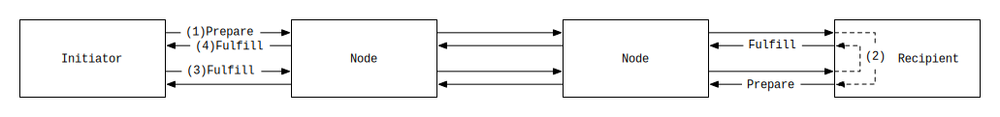

# Interledger Ping Protocol

## Introduction
In order to monitor the health of an internetworked system, it is often useful to be able to send probe messages. In the Internet system, ICMP [echo](https://en.wikipedia.org/wiki/Ping_(networking_utility)#Echo_request) request and response packets are used together to verify connectivity (colloquially known as a "pinging" a host).  

This RFC specifies a similar mechanism for Interledger nodes to test `uptime`, `response-time` and approximate `path cost` for a particular sender/Receiver pair.

## Scope
It is already possible to test unidirectional, end-to-end connectivity in Interledger by sending a small payment using existing mechanisms. However, doing so requires higher-level protocols, such as [SPSP](https://github.com/interledger/rfcs/blob/master/0009-simple-payment-setup-protocol/0009-simple-payment-setup-protocol.md) and [STREAM](https://github.com/interledger/rfcs/blob/master/0029-stream/0029-stream.md).

Instead, this protocol uses only [Interledger-layer](https://github.com/interledger/rfcs/blob/master/0001-interledger-architecture/0001-interledger-architecture.md#interledger-protocol) technologies, plus a known condition/fulfillment pair, to test connectivity between two nodes in the Interledger.
 
The ping protocol is not designed to debug routing issues and does not provide additional diagnostic information about the state of routing. That use case would be better served by a separate `traceroute` mechanism.

All Interledger implementations _SHOULD_ respond to ping protocol requests, unless a node has a specific reason not to, such as security or privacy concerns.

## Overview
This RFC defines two ping protocol modes: unidirectional and bidirectional.

* **Unidirectional**: A ping Initiator sends a specially formed ILP Prepare packet, and the Receiver either fulfills or rejects the packet according to the rules defined in [Unidirectional Mode](#Unidirectional Mode).
* **Bidirectional**: An Initiator sends a specially formed "ping" packet that prompts the Receiver to send an additional "pong" packet. Upon receiving this pong packet, the Initiator either fulfills or rejects according to the rules defined in [Bidirectional Mode](#Bidirectional Mode), thus prompting the Receiver to fulfill or reject the original ping packet.

The primary difference between the two modes is that unidirectional mode allows an Initiator to test connectivity from the Initiator to the Recipient only, whereas bidirectional mode allows the Initiator to test connectivity in both directions.

## Terminology

* The **Initiator** is the Interledger node initiating the ping request.
* The **Recipient** is the Interledger node responding to the Initiator's request.
* **Source amount** is the amount debited from the sender of an ILP payment.
* **Destination amount** is the amount credited to the Recipient of an ILP payment.
* The **Known Preimage** is the [ASCII](https://tools.ietf.org/html/rfc20) string `pingpingpingpingpingpingpingping`, which in binary is `70696E6770696E6770696E6770696E6770696E6770696E6770696E6770696E67`. This value is used in Unidirectional mode only. 
* The **Known Condition** is the SHA256 hash of the Known Preimage, which when encoded using Base64 is `jAC8DGFPZPfh4AtZpXuvXFe2oRmpDVSvSJg2oT+bx34=`. This value is used in Unidirectional mode only.

## Unidirectional Mode

1. Initiator sends a ILP Prepare packet using the following details:
   - **Destination**: Recipient's Interledger address.
   - **Amount**: Any amount chosen by the Initiator.
   - **Expiry**: Any appropriate expiry.
   - **Condition**: The Known Condition, as defined in [Terminology](#terminology).
   
2. Upon receiving the Prepare packet, the Recipient MUST fulfill the payment using the following information:
   - **Fulfillment**: The Known Fulfillment, as defined above.

Note that a Recipient _MAY_ reject the payment if appropriate, for example due to an insufficient amount, invalid expiry, or for other factors.

## Bidirectional Mode

1. Initiator generates a new random 32-byte value to use as a fulfilment (`F`) and generates the corresponding condition (`C`).
2. Initiator sends an ILP Prepare packet to the Recipient with the following details (1):
   - **Destination**: The Recipient's Interledger address.
   - **Amount**: Any amount chosen by the Initiator.
   - **Expiry**: An appropriate expiry that is long enough to allow for two round trips.
   - **Condition**: The condition `C`.
   - **Data**: A concatenated series of bytes with the following information:
      - the bytes of the ASCII string `ECHOECHOECHOECHO`. In hexadecimal this value is `0x4543484F4543484F4543484F4543484F`.
      - the byte `0x00`
      - The ILP address of the Initiator (i.e., the return address) as an OER-encoded, variable length IA5 string.
4. Upon receiving the Prepare packet, the Recipient identifies that it is a bidirectional Ping request by confirming the following:
  1. The packet is addressed directly to itself (i.e. it has no tx or child suffix).
  1. The packet has a payload conforming to the specification above (e.g., the byte following the `ECHOECHOECHOECHO` prefix in the payload is `0x00`).
5. The Recipient DOES NOT immediately send an ILP Fulfill response. Instead the Recipient sends a new ILP `Prepare` packet addressed to the address parsed from the original original packet's payload (2). This new packet has following details: 
    - *Destination*: The Interledger address found in the original packet's data payload.
    - *Amount*: Any amount chosen by the Initiator.
    - *Expiry*: An expiry that is marginally smaller than the expiry on the original ILP Prepare.
    - *Condition*: The same condition `C`.
    - *Data*: A concatenated series of bytes with the following information:
      - the bytes of the ASCII string `ECHOECHOECHOECHO` (i.e., `0x4543484F4543484F4543484F4543484F`).
      - the byte `0x01`
7. Upon receiving this packet, the Initiator identifies that it is a Pong by the fact that it is addressed to the address used in the original Ping request.
8. The Initiator fulfills this second packet using the fulfilment `F` (3).
9. Upon receiving the ILP `Fulfill` packet from the Initiator, the Recipient then fulfills the original Ping request using the same fulfillment `F`.
10. The initiator finally receives the `Fulfill` packet (4).

## Implementation Recommendations

1. The Initiator SHOULD choose a unique address that is only used for a single particular pinging session.
1. Ping packet amounts SHOULD use amounts that are as small as possible such that any agregate losses due to ping traffic would not affect the operation of a Connector.
1. Because a Bidirectional Initiator controls the destination of all packets in the flows defined by this RFC, the Recipient SHOULD be careful to apply proper exchange-rate logic to all packets.
