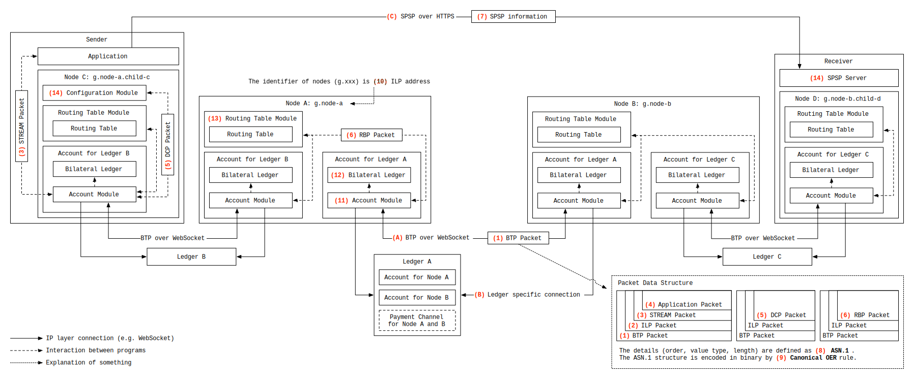

# Relationship between Protocols

## Prerequisites
This document assumes the reader is familiar with the following document:

- [Interledger Architecture](../0001-interledger-architecture/0001-interledger-architecture.md)

## Terminology
- A **node** is a participant in an Interledger network. It may be a [connector](../0001-interledger-architecture/0001-interledger-architecture.md#connectors), a sender or a receiver.
- A **payment** is sending value from one to another but it doesn't mean settled necessarily that is explained below. In the Interledger network, a payment could mean a **node-to-node** payment or an **end-to-end** payment.
  - A **node-to-node** payment means the intention of transferring value of a node (a connector, an endpoint sender, or an endpoint receiver) to another node which is directly connected to the sender node.
  - An **end-to-end** payment means the intention of transferring value of an endpoint sender to an endpoint receiver.
- A **settlement** is ensuring that one has the paid value. For instance, executing a transaction on a certain ledger that the payee has an account on.
  - A **node-to-node** payment is settled by means that the two nodes agreed upon. It is usually a ledger that tracks the amount that both nodes have.
  - An **end-to-end** payment is settled through a chain of settlements of intermediaries above.
  - Using [STREAM](../0029-stream/0029-stream.md) protocol, payments on the Interledger network could be bidirectional, thus settlements could be as well.
  - Refer to [Interledger Architecture](../0001-interledger-architecture/0001-interledger-architecture.md) and [Perspective](#perspective).

## Motivation
Because Interledger Protocol consists of several protocols and some related specifications, it is slightly difficult to grasp the entire relationship between the protocols. It is important for those who concretely implement ILP, to explicate the relationship so that they could quickly imagine how they should go forward. This document aims to build their mental models for ILP. A mental model is what a reader assumes something to be, reading some explanation. The mental model helps the reader predicting the behavior of what is explained even if the details are not given at that time.

## Scope
The scope of this document is the explication of the relationship between the Interledger protocols, and the details for it are out of scope. Some references are given for it though. i.e. This document draws a whole, big picture of ILP.

## Perspective
First of all, the diagram below shows the entire relationship between the protocols.

### Elements and Brief Explanations

- Connections
  - (A) BTP over WebSocket
    - **Node** to **Node** connection
    - In order to exchange payments, configuration and routing information, a node MUST have secure communication channels with its peers. The current implementation uses WebSockets for it.
  - (B) Ledger specific connection
    - **Node** to **Ledger** connection
    - A node needs the means to settle its payments. Therefore the node has a connection to a ledger. The type of connection varies depending on the ledger.
    - In the cases where blockchains are used for settlements, nodes MAY utilize payment channels because it is quick and inexpensive than issuing transactions every time the nodes want to settle.
  - (C) SPSP over HTTPS
    - **Application** to **SPSP Server** connection
    - To determine end-to-end payment information such as a shared secret, a destination address and so forth, an application connects to SPSP server over HTTPS.
- Protocols and related specifications
  - (1) BTP
    - [Bilateral Transfer Protocol 2.0 (BTP/2.0)](../0023-bilateral-transfer-protocol/0023-bilateral-transfer-protocol.md)
    - BTP is used for transferring ILP packets and messages that are used for settlements and so on between two nodes.
  - (2) ILP
    - [Interledger Protocol V4 (ILPv4)](../0027-interledger-protocol-4/0027-interledger-protocol-4.md)
    - ILP is used for sending payment packets across multiple hops. Some other protocols, including those for node configuration and routing, are also built on top of ILP and use ILP packets to communicate that information between peers.
  - (3) STREAM
    - [STREAM - A Multiplexed Money and Data Transport for ILP](../0029-stream/0029-stream.md)
    - STREAM is built on top of ILP, and is used for transferring money and data bidirectionally from applications.
    - Applications MAY build their own protocols on top of STREAM, and put data of the protocols into expansible data area of ILP.
  - (4) Application
    - The extensible data area of STREAM packets is used arbitrarily by applications.
  - (5) DCP
    - [Interledger Dynamic Configuration Protocol (ILDCP) v1](../0031-dynamic-configuration-protocol/0031-dynamic-configuration-protocol.md)
    - DCP is used in order to exchange node information such as an ILP address.
  - (6) RBP
    - Route Broadcasting Protocol
    - RBP is used for transferring routing information to build routing tables.
  - (7) SPSP
    - [The Simple Payment Setup Protocol (SPSP)](../0009-simple-payment-setup-protocol/0009-simple-payment-setup-protocol.md)
    - SPSP is used to determine end-to-end payment information such as a shared secret, a destination address and so forth.
  - (8) ASN.1
    - [ASN.1 Project](https://www.itu.int/en/ITU-T/asn1/)
    - ASN.1 is used in order to specify data structure (order, type, and length).
    - Concrete packet structure of protocols is defined using ASN.1.
      - [asn1](../asn1/README.md)
  - (9) Canonical OER
    - [Notes on OER Encoding](../0030-notes-on-oer-encoding/0030-notes-on-oer-encoding.md)
    - ASN.1 doesn't specify its encoding rule. i.e. How packets are encoded in binary is defined separately.
    - Canonical OER is one of the specifications that define the encoding rule.
  - (10) ILP Address
    - [ILP Addresses](../0015-ilp-addresses/0015-ilp-addresses.md)
    - An ILP address identifies a node.

The functions shown below are just concepts, so it MAY shape differently depending on concrete implementations.

- Functions
  - (11) Account Module
    - An account module manages connections to both a counterpart node and a ledger.
  - (12) Bilateral Ledger
    - [Bilateral Transfer Protocol 2.0 (BTP/2.0)](../0023-bilateral-transfer-protocol/0023-bilateral-transfer-protocol.md#terminology)
    - A bilateral ledger tracks the balance of two nodes connected each other, including unsettled node-to-node payments.
  - (13) Routing Table Module
    - [Link to routing table](..)
    - A routing table module aggregates incoming routing information and build the best routes for prefixes.
  - (14) Configuration Module
    - [Interledger Dynamic Configuration Protocol (ILDCP) v1](../0031-dynamic-configuration-protocol/0031-dynamic-configuration-protocol.md)
    - A configuration module retrieves an ILP address that the node should use and the other information from the parent node.