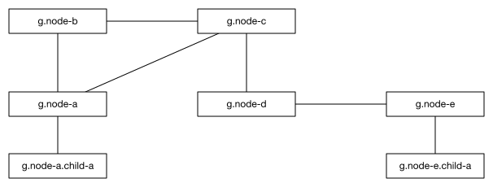
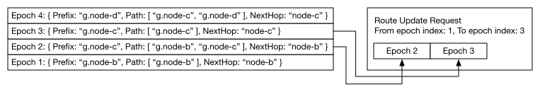

# Route Broadcasting Protocol (RBP)

## Prerequisite
Before looking into this document, reading the following documents is highly recommended to understand the prerequisite knowledge.

- [Interledger Architecture](../0001-interledger-architecture/0001-interledger-architecture.md)
- [Interledger Protocol V4 (ILPv4)](../0027-interledger-protocol-4/0027-interledger-protocol-4.md)
- [Bilateral Transfer Protocol](../0023-bilateral-transfer-protocol/0023-bilateral-transfer-protocol.md)
  - RBP information is sent in ILP packets, and ILP packets are transferred in BTP packets.
- [A Border Gateway Protocol 4 (BGP-4)](https://tools.ietf.org/html/rfc4271)
  - The functionality of Route Broadcasting Protocol is similar to that of BGP.

## Terminology
- A **node** represents a [connector](../0001-interledger-architecture/0001-interledger-architecture.md#connectors) in this document.
- A **hop** is going over a boundary to another space, or is the destination space itself. For instance, sending a packet from a node to another node is one hop.
- An **ILP Address** is an identifier of a node or an account held by a node, that is different from an [IP address](https://tools.ietf.org/html/rfc791) or a [domain name](https://tools.ietf.org/html/rfc1035). Refer to [ILP Addresses - v2.0.0](../0015-ilp-addresses/0015-ilp-addresses.md) for more.
- A **route** is a path: a series of nodes that a packet goes through.

## Scope
In this document, the routing logic, how to determine the next hop of ILP packets is out of scope while the focus is placed on how routing information, that is used to decide how ILP packets are routed, is transferred from a node to the other nodes.

## Overview
Interledger Protocol is a protocol suite that consists of several protocols including [Bilateral Transfer Protocol](../0023-bilateral-transfer-protocol/0023-bilateral-transfer-protocol.md), Interledger Dynamic Configuration Protocol, and the other protocols. Route Broadcasting Protocol is one of them.

In short, **Route Broadcasting Protocol is a protocol for transferring routing information from a node to the other nodes in ILP packets**. The routing information roughly includes the following elements (refer to [Protocol Detail](#protocol-detail) for more).

- Prefix (string)
  - e.g. `g.node-c`
  - The prefix that this route can finally reach.
- Path (an array of string)
  - e.g. `g.node-a` `g.node-b` `g.node-c`
  - The hops that the packet will go through.
  - A packet will be sent from left node to right node in order.

The node receives and utilizes these to determine which node ILP packets should be routed through, building a **routing table** that is explained later in the [Routing Table](#routing-table) section.

## Routing
### Routing Table
Interledger network works like the Internet; ILP nodes route ILP packet among the nodes while routers of the Internet route its packets among ASs ([Autonomous System](https://tools.ietf.org/html/rfc1930)). A node can be connected to multiple nodes like a web.

Because a node has to route ILP packets to a certain next node appropriately depending on the destination address, so that the packets finally reach the specified address, the node needs to know which node can be the most efficient first hop for the destination ILP address. Therefore a node MUST know the mapping of:

- Key
  - `Prefix`: The ILP address prefix that this route can handle.
- Value
  - Route information
    - `Next hop`: An identifier of the next node that is connected to the node directly.
    - `Path`: How many hops the ILP packets will go through if sent. Generally, the number of elements of the path is expected to be less for efficiency because hops possibly cost network and server burden, or relaying fee.

This mapping is called a **routing table**. In order to build a routing table, a node requests routing information to connected nodes respectively, or a node could possibly load static route configuration from a file.

*A routing table may be a mere list that contains `Prefix`, `Next hop`, and `Path`, it doesn't need to be a map necessarily. That said, a map is more suitable for this case than a list because of the efficiency of looking up.*

### Routing Table Lifecycle
The lifecycle of a routing table is like the below:

- Created
  - The table is empty at this point
- Updated repeatedly
  - By static configuration, though this is usually done only once when the node starts up
  - By updates from the other nodes
- Disposed
  - When the node is shutdown
  - When the node is restarted

### Routing Table ID
A routing table has its identifier, that is called **routing table ID**. A routing table ID is used for identifying its instance, and the ID is given when the table is created as empty. A routing table ID is a UUID.

### Epoch
Every time the routing table is modified, the update is logged and the revision number of the table is increased. The revision number of the table is called an **epoch**.

A node maintains the epoch that is already known to the counter node, and considers it when requesting route updates so that the node can send only the difference (a stack of adding or withdrawing routes) from the last update with the last known epoch as the starting point. So the node doesn't need to send the whole routing table.

Because the logs of difference could be a large number in some cases, the node may send updates separately multiple times. In that case, "from" and "to" epoch will be specified to express the range of the logs.

The left image shows how epochs are stored. The right image shows an example of a route update request, how "from" and "to" epoch index are given, and how epochs are extracted from the logs.

If the routing table ID that an epoch is based on is changed, the epoch MUST be reset to `0`, so that the counter node can track all the updates from the node.

### Node Finite State Machine (FSM)
A node is kind of an FSM that has a status of either:

- IDLE
  - Does not send route update to the counterpart node.
- SYNC
  - Does send route update to the counterpart node.

The status can be changed by a route control request that is described below.

## Protocol Detail
### Route Control
#### Procedure
Route control is done in the following procedure:

- A node requests IDLE or SYNC mode to the corresponded node.
- The corresponded node changes its status if needed, and respond that the request is done.
- If the request cannot be deserialized or interpreted as appropriate, the corresponded node responds error.

#### Packet
The request above is transferred in ILP packets in a specific manner. The manner is:

- Request
  - The `type` of the ILP packet is `ILP Prepare` (type id: 12)
  - The `amount` of the ILP packet is `0`
  - The `expiresAt` of the ILP packet is arbitrary
  - The `executionCondition` of the ILP packet is `Zmh6rfhivXdsj8GLjp+OIAiXFIVu4jOzkCpZHQ1fKSU=` in Base64 format
  - The `destination` address of the ILP packet is `peer.route.control`
  - The `data` of the ILP packet is described at `RouteControlRequestData` in [ASN.1 definition](#asn1-definition)
- Response
  - The `type` of the ILP packet is `ILP Fulfill` (type id: 13)
  - The `fulfillment` of the ILP packet is 32byte octet string all filled with zeros
  - The `data` of the ILP packet is empty (size: 0)
- Error
  - The `type` of the ILP packet is `ILP Reject` (type id: 14)
  - The `code` of the ILP packet is arbitrary, depending on the situation
  - The `message` of the ILP packet is arbitrary, depending on the situation
  - The `triggeredBy` of the ILP packet is the ILP address of the node where the error occuered
  - The `data` of the ILP packet is empty (size: 0)

### Route Update
#### Procedure
Route Update is done in the following procedure:

- A node requests an update to the corresponded node with information of route update logs.
- The corresponded node updates its routing table, and respond that the request is done.
- If the request cannot be deserialized or interpreted as appropriate, the corresponded node responds error.

#### Packet
- Request
  - The `type` of the ILP packet is `ILP Prepare` (type id: 12)
  - The `amount` of the ILP packet is `0`
  - The `expiresAt` of the ILP packet is arbitrary
  - The `executionCondition` of the ILP packet is `Zmh6rfhivXdsj8GLjp+OIAiXFIVu4jOzkCpZHQ1fKSU=` in Base64 format
  - The `destination` address of the ILP packet is `peer.route.update`
  - The `data` of the ILP packet is described at `RouteUpdateRequestData` in [ASN.1 definition](#asn1-definition)
- Response
  - The `type` of the ILP packet is `ILP Fulfill` (type id: 13)
  - The `fulfillment` of the ILP packet is 32byte octet string all filled with zeros
  - The `data` of the ILP packet is empty (size: 0)
- Error
  - The `type` of the ILP packet is `ILP Reject` (type id: 14)
  - The `code` of the ILP packet is arbitrary, depending on the situation
  - The `message` of the ILP packet is arbitrary, depending on the situation
  - The `triggeredBy` of the ILP packet is the ILP address of the node where the error occuered
  - The `data` of the ILP packet is empty (size: 0)

### ASN.1 Definition
The ASN.1 definition of ILP packets is described in [InterledgerProtocol.asn](../asn1/InterledgerProtocol.asn) and Route Broadcasting Protocol data is in [RouteBroadcastingProtocol.asn](./RouteBroadcastingProtocol.asn) as well.

### Encoding Rule
How ASN.1 types are written into binary is described in [Notes on OER Encoding](../0030-notes-on-oer-encoding/0030-notes-on-oer-encoding.md).
