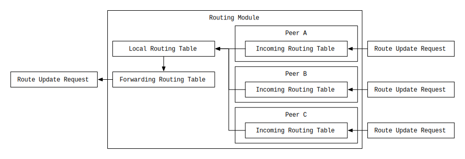

# Route Broadcasting Protocol (RBP)

## Prerequisites
This specification assumes the reader is familiar with the following documents:

- [Interledger Architecture](../0001-interledger-architecture/0001-interledger-architecture.md)
- [Interledger Protocol V4 (ILPv4)](../0027-interledger-protocol-4/0027-interledger-protocol-4.md)
- [Bilateral Transfer Protocol](../0023-bilateral-transfer-protocol/0023-bilateral-transfer-protocol.md)
  - RBP information is sent in ILP packets, and ILP packets are transferred in BTP packets.
- [A Border Gateway Protocol 4 (BGP-4)](https://tools.ietf.org/html/rfc4271)
  - The functionality of Route Broadcasting Protocol is similar to that of BGP.

## Terminology
- A **node** is a participant in an Interledger network. It may be a [connector](../0001-interledger-architecture/0001-interledger-architecture.md#connectors), a sender or a receiver.
- A **hop** is going over a boundary to another space, or is the destination space itself. For instance, sending a packet from a node to another node is one hop.
- An **ILP Address** is an identifier of a node or an account held by a node, that is different from an [IP address](https://tools.ietf.org/html/rfc791) or a [domain name](https://tools.ietf.org/html/rfc1035). Refer to [ILP Addresses - v2.0.0](../0015-ilp-addresses/0015-ilp-addresses.md) for more.
- A **route** is a path: a series of nodes that a packet goes through.

## Scope
In this document, the routing logic, how to determine the next hop of ILP packets is out of scope while the focus is placed on how routing information, that is used to decide how ILP packets are routed, is transferred from a node to the other nodes.

## Overview
Interledger Protocol is a protocol suite that consists of several protocols including [Bilateral Transfer Protocol](../0023-bilateral-transfer-protocol/0023-bilateral-transfer-protocol.md), [Interledger Dynamic Configuration Protocol](../0031-dynamic-configuration-protocol/0031-dynamic-configuration-protocol.md), and the other protocols. Route Broadcasting Protocol is one of them.

In short, **Route Broadcasting Protocol is a protocol for transferring routing information from a node to the other nodes in ILP packets**. The routing information roughly includes the following elements (refer to [Protocol Detail](#protocol-detail) for more).

- Prefix (string)
  - e.g. `g.node-c`
  - The prefix that this route can finally reach.
- Path (an array of string)
  - e.g. `g.node-a` `g.node-b` `g.node-c`
  - The hops that the packet will go through.
  - A packet will be sent from left node to right node in order.

The node receives and utilizes these to determine which node ILP packets should be routed through, building a **routing table** that is explained later in the [Routing Table](#routing-table) section.

## Routing
### Routing Table
Interledger network works like the Internet; ILP nodes route ILP packet among the nodes while routers of the Internet route its packets among ASs ([Autonomous System](https://tools.ietf.org/html/rfc1930)). A node can be connected to multiple nodes like a web.

Because a node has to route ILP packets to a certain next node appropriately depending on the destination address, so that the packets finally reach the specified address, the node needs to know which node can be the most efficient first hop for the destination ILP address. Therefore a node MUST know the mapping of:

- Key
  - `Prefix`: The ILP address prefix that this route can handle.
- Value
  - Route information
    - `Next hop`: An identifier of the next node that is connected to the node directly.
    - `Path`: How many hops the ILP packets will go through if sent. Generally, the number of elements of the path is expected to be less for efficiency because hops possibly cost network and server burden, or relaying fee.

This mapping is called a **routing table**. In order to build a routing table, a node requests routing information to connected nodes respectively, or a node could possibly load static route configuration from a file.

*A routing table may be a mere list that contains `Prefix`, `Next hop`, and `Path`, it doesn't need to be a map necessarily. That said, a map is more suitable for this case than a list because of the efficiency of looking up.*

A node sends an ILP packet to the next node that is determined by referencing the routing table **of the sending node** and the further hops are NOT determined at that time. The next node determines, referencing **its own routing table**, which node could be the best when received the ILP packet. This chain of discrete decisions of routes is the basis of the routing of the Interledger network.

### Routing Table Lifecycle
The lifecycle of a routing table is like the below:

- Created
  - The table is empty at this point
- Updated repeatedly
  - By static configuration, though this is usually done only once when the node starts up
  - By updates from the other nodes
- Disposed
  - When the node is shutdown
  - When the node is restarted

### Routing Table ID
A routing table has its identifier, that is called **routing table ID**. A routing table ID is used for identifying its instance, and the ID is given when the table is created as empty. A routing table ID is a [UUID v4](https://tools.ietf.org/html/rfc4122#section-4.1.3).

### Epoch
Every time the routing table is modified, the update is logged and the revision number of the table is increased. The revision number of the table is called an **epoch**.

A node maintains the epoch that is already known to the counterpart node, and considers it when requesting route updates so that the node can send only the difference (a stack of adding or withdrawing routes) from the last update with the last known epoch as the starting point. So the node doesn't need to send the whole routing table.

Because the logs of difference could be a large number in some cases, the node may send updates separately multiple times. In that case, "from" and "to" epoch will be specified to express the range of the logs.

The left image shows how epochs are stored. The right image shows an example of a route update request, how "from" and "to" epoch index are given, and how epochs are extracted from the logs.

If the routing table ID that an epoch is based on is changed, the epoch MUST be reset to `0`, so that the counterpart node can track all the updates from the node.

### Link Relations and Routing
There are two types of link relations:
- `Peer` to `Peer`
- `Parent` to `Child`

In a `Parent` to `Child` relation, the ILP address of the child node is configured automatically using [IL-DCP](../0031-dynamic-configuration-protocol/0031-dynamic-configuration-protocol.md), and generally it is a sub-address of the parent node though it is not a requirement. For instance:
- `Parent` node
  - `g.parent-node`
- `Child` node
  - `g.parent-node.child-node`
  - this is a sub-address of `g.parent-node`

In this case, the parent node already knows the address of the child node, so the routing is a truism. The parent node knows when to transfer ILP packets to the child node, and the child node transfers ILP packets basically to the parent node because it is the gateway to the other addresses for the child node.

On the other hand, in a `Peer` to `Peer` relation, the two nodes have different addresses respectively, and the further connected addresses are unclear. So in this case, it is generally helpful to configure to exchange routing information each other.

Conclusively, the following is the default configuration of nodes depending on the relations.
- `Peer` to `Peer`
  - Configured to exchange routing information.
  - Does send route control requests and route update requests that are explained later in the [Requests](#requests) section.
- `Parent` to `Child`
  - Configured **NOT** to exchange routing information.
  - Does **NOT** send route control requests and route update requests.
  - That said, the nodes MAY be configured to exchange routing information for some specific situations.

### Node Finite State Machine (FSM)
Each node consists of state machines which track states for each routing counterpart node:

- IDLE
  - Does **NOT** send routing information to the counterpart node.
- SYNC
  - Does send route routing information to the counterpart node.

The status can be changed by a **route control request** that is described below. The routing information is provided by a **route update request** that is described below as well.

### Security of Routing Information

(to be written)

### Types of Routing Table

An ILP node has 3 types of routing tables, although it depends on the concrete implementation. It means that these are not requirements, but a typical implementation.

1. `Incoming Routing Table`
1. `Local Routing Table`
1. `Forwarding Routing Table`

The relationship between the types are described as the below.

#### Incoming Routing Table

An ILP node has multiple Incoming Routing Tables for each counterpart node because Routing Table IDs are specified by the nodes and the IDs have different lifecycles for each one. Thus these Incoming Routing Tables manage Route Update Requests from the counterpart nodes respectively. The table is updated by Route Update Requests, and it MAY be filtered before added to the table. Also, it MAY be tagged so that it can be filtered when a routing module refers the routing information.

#### Local Routing Table

A Local Routing Table aggregates the routing information of the Incoming Routing Tables and maintains the routing table that is referred when the node decides which peer the node should pass an ILP packet to. The table is updated when Route Update Requests are received, and it MAY be filtered before added to the table.

#### Forwarding Routing Table

From a Local Routing Table, a Forward Routing Table is generated. A Forward Routing Table is characteristic in the following points.

- The node itself, which has the Forward Routing Table, is added to the `path` field.
- The node overrides the `auth` field to define that the routing information is exactly generated by the node.
  - The value of the `auth` field is an authentication code which is generated with a shared secret.
  - See [Security of Routing Information](#Security-of-Routing-Information) for the entire security model.

## Protocol Detail
### Operation Model
The entire operation model is shown below.

#### Requests
- `Route Control Request`
  - A request that ask the receiver node to be a specified state ([IDLE or SYNC](#node-finite-state-machine-fsm)).
- `Route Update Request`
  - A request that conveys routing information and ask the receiver node to update its routing table based on the information.

#### Nodes
- `Node A`
  - Connected to `Node B`.
  - A node that wants routing information from `Node B` to build its routing table.
  - `Node A` wants `Node B` to send route update requests that convey routing information.
- `Node B`
  - Connected to `Node A`.
  - A node whose status is IDLE at this point that means this node doesn't send any route update request to `Node A`.

#### Procedure
This is a normal procedure for instance.

- `Node A` sends a **route control request** of `SYNC` to `Node B`
- `Node B` receives the route control request and updates its status to `SYNC`
  - This means that from hence, `Node B` sends route update requests to provide routing information for `Node A`
- `Node B` responds that the state is correctly updated to `Node A`
- (some time after the procedure above)
- `Node B` sends a **route update request** that has routing information (some logs) to `Node A`
- `Node A` receives the route update request, and updates its routing table based on the provided information.
- `Node A` responds that the routing table is correctly updated to `Node B`

#### Packet
The request and the response above are transferred in [ILP packets](../0027-interledger-protocol-4/0027-interledger-protocol-4.md#specification). 

The `fulfillment` of the response packet is always a zero-filled 32 byte octet string, therefor the condition is always the SHA-256 hash digest of that, i.e. the Base64 decoded value of `Zmh6rfhivXdsj8GLjp+OIAiXFIVu4jOzkCpZHQ1fKSU=`.

As with other bilateral protocols the packets are addressed directly to the peer using the `peer.` address prefix. RBP packets are specifically identified using the address `peer.route`.

All current implementations of RBP default to an amount of `0` in the ILP packets used to request route control or update.

### Route Control
#### Procedure
Route control is done in the following procedure:

- A node requests IDLE or SYNC mode to the corresponded node.
- The corresponded node changes its status if needed, and respond that the request is done.
- If the receiving node is not configured to send route updates, the receiving node responds with an error.
- If the request cannot be deserialized or interpreted as appropriate, the corresponded node responds with an error.

#### Packet
- Request
  - The `type` of the ILP packet is `ILP Prepare` (type id: 12)
  - The `amount` of the ILP packet is `0`
  - The `expiresAt` of the ILP packet is arbitrary
  - The `executionCondition` of the ILP packet is `Zmh6rfhivXdsj8GLjp+OIAiXFIVu4jOzkCpZHQ1fKSU=` in Base64 format
  - The `destination` address of the ILP packet is `peer.route.control`
  - The `data` of the ILP packet is described at `RouteControlRequestData` in [ASN.1 definition](#asn1-definition)
    - If any extra data is included, it SHOULD be ignored for compatibility
- Response
  - The `type` of the ILP packet is `ILP Fulfill` (type id: 13)
  - The `fulfillment` of the ILP packet is 32byte octet string all filled with zeros
  - The `data` of the ILP packet is empty (size: 0)
    - If included, it SHOULD be ignored for compatibility
- Error
  - The `type` of the ILP packet is `ILP Reject` (type id: 14)
  - The `code` of the ILP packet is arbitrary, depending on the situation
  - The `message` of the ILP packet is arbitrary, depending on the situation
  - The `triggeredBy` of the ILP packet is the ILP address of the node where the error occuered
  - The `data` of the ILP packet is empty (size: 0)
    - If included, it SHOULD be ignored for compatibility

### Route Update
#### Procedure
Route Update is done in the following procedure:

- A node sends a route update request to the corresponded node with information of route update logs.
- The receiver node updates its routing table, and responds that the request is done.
- If the receiving node is not configured to receive route updates, the receiving node responds with an error.
- If the request cannot be deserialized or interpreted as appropriate, the corresponded node responds with an error.

#### Packet

If `node A` sends Route Update Request to `node B`, `node A` MUST add its own ILP address to the `path` field of the `addedRoutes` field in the request. It will be the very first, the leftmost element in the sequence of a path in the request. See `RouteUpdateRequestData` in [ASN.1 definition](#asn1-definition) for more.

- Request
  - The `type` of the ILP packet is `ILP Prepare` (type id: 12)
  - The `amount` of the ILP packet is `0`
  - The `expiresAt` of the ILP packet is arbitrary
  - The `executionCondition` of the ILP packet is `Zmh6rfhivXdsj8GLjp+OIAiXFIVu4jOzkCpZHQ1fKSU=` in Base64 format
  - The `destination` address of the ILP packet is `peer.route.update`
  - The `data` of the ILP packet is described at `RouteUpdateRequestData` in [ASN.1 definition](#asn1-definition)
    - If any extra data is included, it SHOULD be ignored for compatibility
- Response
  - The `type` of the ILP packet is `ILP Fulfill` (type id: 13)
  - The `fulfillment` of the ILP packet is 32byte octet string all filled with zeros
  - The `data` of the ILP packet is empty (size: 0)
    - If included, it SHOULD be ignored for compatibility
- Error
  - The `type` of the ILP packet is `ILP Reject` (type id: 14)
  - The `code` of the ILP packet is arbitrary, depending on the situation
  - The `message` of the ILP packet is arbitrary, depending on the situation
  - The `triggeredBy` of the ILP packet is the ILP address of the node where the error occuered
  - The `data` of the ILP packet is empty (size: 0)
    - If included, it SHOULD be ignored for compatibility

### ASN.1 Definition
The ASN.1 definition of ILP packets is described in [InterledgerProtocol.asn](../asn1/InterledgerProtocol.asn) and Route Broadcasting Protocol data is in [RouteBroadcastingProtocol.asn](./RouteBroadcastingProtocol.asn).

### Encoding Rule
All ASN.1 types are encoded using [Octet Encoding Rules](../0030-notes-on-oer-encoding/0030-notes-on-oer-encoding.md) as is the norm with all Interledger protocols.