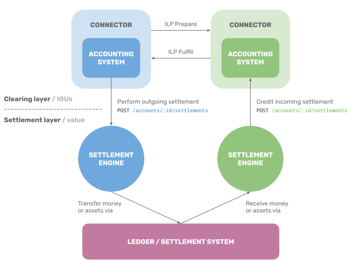

# Settlement Engines

## Conventions

The key words "MUST", "MUST NOT", "REQUIRED", "SHALL", "SHALL NOT", "SHOULD", "SHOULD NOT", "RECOMMENDED", "MAY", and "OPTIONAL" in this document are to be interpreted as described in [RFC 2119](https://tools.ietf.org/html/rfc2119).

## Overview

This specification codifies a common interface for **settlement engines**. Settlement engines are services which perform two primary operations:

1. Send outgoing settlements
2. Receive incoming settlements

Counterparties may operate compatible settlement engines to settle their liabilities between one another. Different implementations may utilize different settlement systems or types of settlements, such as:

- Transferring money or assets to the counterparty
- Sending payments on a shared ledger
- Signing and exchanging payment channel claims

## Motivation

Settlement engines supercede the [Ledger Plugin Interface (LPIv2)](../deprecated/0024-ledger-plugin-interface-2/0024-ledger-plugin-interface-2.md), an earlier abstraction for settlement integrations with Interledger. This new model addresses these issues:

1. Multi-account plugins required logic for handling ILP packets, increasing implementation complexity.
2. Plugins bundled settlement and bilateral communication functionality together, limiting composability.
3. JavaScript plugins limited interoperability with non-JavaScript connector implementations.
4. Plugins operated in the same process as the connector, which limited scaling the two services independently.

TODO Should I explicitly outline the "goals"? What is the aim of this specification? (seems to be some disagreement)

## The Flow

In the [Interledger protocol](../0001-interledger-architecture/0001-interledger-architecture.md), a **peer** is a connector who is a counterparty to another connector. An **account** is the connector's relationship with the counterparty, representing their arrangement to transact with one another. Connectors clear and fulfill ILP packets with their peers, which represent conditional IOUs that affect these accounts.

A connector may extend a given peer a limited line of credit, or none at all, depending upon their trustworthiness. As the connector receives incoming ILP Prepare packets from a peer, forwards them, and returns corresponding ILP Fulfill packets, that peer's liabilities to the connector accrue. If the peer's liabilities exceed the credit limit assigned to it, the connector may reject and decline to forward additional packets.

In order to continue transacting, the peer must settle their liabilities. In most cases, this is accomplished through sending a payment on a settlement system that both peers have agreed to use. The connector should credit the incoming payment, irrevocably discharging a sum the peer owed to it, which enables clearing subsequent packets from the peer.

Settlement engines provide a standardized mechanism for Interledger connectors to coordinate and reconcile these settlements.



## Accounting

Connectors MUST record their transactions with peers and/or the effects of their transactions with peers through the process of accounting.

In this accounting context, an **account** represents amounts received (credits) and amounts owed (debits) for a set of transactions between counterparties. The **balance** of an account is the net difference between these credits and debits. All the balances and transactions of an account are denominated in a single, fungible asset.

Interledger connectors are RECOMMENDED to operate an **accounting system** which keeps a record of two accounts for each peer:

- **Accounts payable**, the amount owed by the connector to its peer for packets its peer has fulfilled.
  - Positive amount indicates the connector is indebted to its peer (a _liability_ for the connector).
  - Negative amount indicates the connector has sent a pre-payment to its peer.
- **Accounts receivable**, the amount owed to the connector by its peer for packets the connector has fulfilled.
  - Positive amount indicates its peer is indebted to the connector (an _asset_ to the connector).
  - Negative amount indicates its peer has sent a pre-payment to the connector.


Thus, a given connector's "accounts payable" balance should mirror its peer's "accounts receivable" balance. Likewise, a connector's "accounts receivable" balance should mirror its peer's "accounts payable" balance.

## Settlement

A **settlement** is the irrevocable discharge of a liability by providing something of value to the party owed.

Settlements may occur on a **settlement system**, or medium for exchanging value. Some settlements may transfer funds on a **ledger**, or registry of account balances and/or transactions, which is a type of settlement system. (Although not all settlement systems are ledgers, here, the terms are sometimes used interchangeably.)

Examples of settlement systems include:

TODO Are these actually settlement systems?

- Bank clearing houses
- Credit card processors
- Money transfer services
- Cryptocurrencies, blockchains, and distributed ledgers
- Payment channels and layer 2 networks
- Cash or physical delivery of assets

## Double-entry bookkeeping

TODO Evan: Is it correct to refer to it as "credit" if you were prefunding or settling things right away? (It might be, but then it would be worth clarifying the different uses of credit -- IOUs, "credits vs debits", and this usage)

TODO Explain clearing vs settlement?

Together, a settlement engine and an accounting system interface with one another to perform double-entry bookkeeping. To ensure accurate, balanced double-entry bookkeeping, settlement engine and accounting system implementations MUST enforce several invariants.

### Accounting system invariants

#### Account for outgoing settlements

The accounting system is responsible for triggering outgoing settlements. For example, when the accounts payable reaches a particular threshold, the accounting system SHOULD trigger a settlement to reduce the amount owed to the peer to a predefined, lesser amount in order to be able to continue transacting with the peer.

If the accounting system opts to trigger a settlement:

1. The accounting system MUST debit the accounts payable, subtracing the amount of the settlement.
2. Then, the accounting system MUST send a request to the settlement engine to settle the amount.

If the settlement engine responds that it only queued a partial amount for settlement (due to lesser precision), the accounting system MUST credit back the accounts payable, adding the leftover amount.

If request retries fail per the [idempotence rules](#idempotence), the accounting system MUST credit back the accounts payable, adding the amount of the failed settlement.

#### Account for incoming settlements

If the settlement engine instructs the accounting system a settlement was received, the accounting system MUST credit the accounts receivable, subtracting the amount of the settlement.

The accounting system MUST respond with the amount it credited to the account. If it only credited a partial amount (due to lesser precision), the settlement engine tracks the leftover, uncredited amount and includes it in the next incoming settlement notification to the accounting system.

### Settlement symmetry invariant

The fundamental expected behavior of a settlement engine implementation is the sum of amounts one instance is instructed to settle eventually equals the sum of amounts the recipient instance instructs its accounting system to credit as incoming settlements.

As long as the instructed settlements do not equal the acknowledged settlements, the double-entry bookkeeping is out-of-balance. Settlement engines SHOULD minimize the time that the bookkeeping is unbalanced.

When the accounting system triggers a settlement, the accounting system should preemptively debit the accounts payable balance before any settlement has been initiated. During this time, the accounts payable balance of the settlement sender will be inconsistent with the accounts receivable balance of the settlement receiver.

Many factors may result in these inconsistencies:

#### Settlement delay

All settlement engine implementations necessitate some settlement delay, or time until an instructed settlement is credited by the counterparty, due to network latency between peers or the time to finalize settlements on an underlying ledger or system.

#### Failed outgoing settlements

If an outgoing settlement fails, the settlement engine MUST track the amount of the settlement to retry it later.

An intentional design decision was to hide failures from the accounting system rather than refunding failed settlements back to the accounts payable. Since the settlement engine tracks these failed amounts, if the conditions change so the settlement engine is later able to settle, a new settlement attempt may safely begin immediately.

Refunding failed settlements would enable the peer's accounting system balances to appear synchronized. However, if settlement continues to fail, the credit limit would eventually be breached and prevent the peers from transacting, negating this utility.

#### Uncredited incoming settlements

After the settlement engine requests the accounting system to credit an incoming settlement, if the accounting system responds that it only credited a partial amount (due to lesser precision), the settlement engine MUST track the uncredited leftover amount.

If the request fails after retrying per the [idempotence rules](#idempotence), the settlement engine MUST track the uncredited amount in order to retry later.

When a subsequent settlement is received, the settlement engine MUST request the accounting system to credit a new incoming settlement for the total amount yet to be credited, including the leftover, uncredited amount(s).

#### Operating inconsistences

Operators and external factors outside the control of the settlement engine implementation may also cause inconsistences, such as network connectivity, peers operating incompatible settlement engines, or malicious peers.

## Exchanging messages

In order to settle or receive settlements with a peer, a settlement engine may first need to retrieve or communicate information with the peer's settlement engine. Two peered settlement engine instances may send and receive settlement-related messages among themselves, such as identifiers for their ledger accounts.

To support multiple interoperable settlement engine implementations for a particular settlement system, implementators may standardize the schema and type of messages their settlement engines use to communicate with one another. This work is out-of-scope of this RFC.

Interledger connectors use a transport, such as HTTP or WebSockets, to send and receive data with peers. Settlement engine implementations SHOULD proxy all messages through its Interledger connector's existing transport like so:

1. Origin settlement engine sends a request to its connector with the settlement-related message to forward.
2. Origin connector encodes the raw message within an ILP Prepare packet (described below), which is sent to the peer's connector using its existing transport.
3. Peer connector receives the message within the ILP Prepare, identifies which settlement engine instance the account is associated with, and sends a request to its settlement engine to handle the message. The peer connector MUST NOT forward the ILP Prepare to any other connectors.
4. Peer settlement engine processes the message and responds with its own message.
5. Peer connector sends the response message back across the transport to the origin connector within an ILP Fulfill or ILP Reject, depending upon the code of the response (described below). If the peer, connector was unable to process the request, it MUST respond with an ILP Reject.
6. Origin connector sends the response message back to the origin settlement engine.

### ILP Prepare

- `amount`: `0`
- `expiresAt`: _Determined by connector_
- `executionCondition`: `e3b0c44298fc1c149afbf4c8996fb92427ae41e4649b934ca495991b7852b855`
- `destination`: `peer.settle`
- `data`: _Request message from sender settlement engine_

### ILP Fulfill

- `fulfillment`: `0000000000000000000000000000000000000000000000000000000000000000`
- `data`: _Response message from recipient settlement engine_

### ILP Reject

- `code`: _Determined by connector from HTTP status of forwarded request_
- `triggeredBy`: `peer.settle`
- `message`: _Determined by connector_
- `data`: _Response message from recipient settlement engine, or empty if antecedent failure_

## Accounts and identifiers

Each account MUST be identified by a unique, [URL-safe](https://tools.ietf.org/html/rfc3986#section-2.3) string, immutable for the lifetime of the account.

The settlement engine MUST be responsible for correlating an account identifier to the peer's identity on the shared ledger or settlement system, if required. For separation of concerns between clearing and settlement, the accounting system is NOT RECOMMENDED to have knowledge of the peer's identity on the shared settlement system.

## Units and quantities

Asset amounts may be represented using any arbitrary denomination. For example, one U.S. dollar may be represented as \$1 or 100 cents, each of which is equivalent in value. Likewise, one Bitcoin may be represented as 1 BTC or 100,000,000 satoshis.

A **standard unit** is the typical unit of value for a particular asset, such as \$1 in the case of U.S. dollars, or 1 BTC in the case of Bitcoin.

A **fractional unit** represents some unit smaller than the standard unit, but with greater precision. Examples of fractional monetary units include one cent (\$0.01 USD), or 1 satoshi (0.00000001 BTC).

An **asset scale** is the difference in orders of magnitude between the standard unit and a corresponding fractional unit. More formally, the asset scale is a non-negative integer (0, 1, 2, …) such that one standard unit equals the value of `10^(scale)` corresponding fractional units. If the fractional unit equals the standard unit, then the asset scale is 0.

For example, one cent represents an asset scale of 2 in the case of USD, whereas one satoshi represents an asset scale of 8 in the case of Bitcoin.

### Selecting scales

Settlement engines are RECOMMENDED to perform or fulfill requests with amounts denominated in the same scale as its settlements.

Account balances within the accounting systems are RECOMMENDED to be denominated in the same scale as their corresponding settlement engine, but MAY use different ones. For example, micropayments may require more precision than can actually be settled, or databases may limit precision to less than the settlement system is capable of.

### **`Quantity`** object

An amount denominated in some unit of a single, fungible asset. (Since each account is denominated in a single asset, the type of asset is implied.)

#### Attributes

- **`amount`** — string
  - Amount of the unit, which is a non-negative integer.
  - This amount is encoded as a string to ensure no precision is lost on platforms that don't natively support arbitrary precision integers.
- **`scale`** — number
  - Asset scale of the unit, between `0` and the maximum 8-bit unsigned integer, `255` (inclusive).

#### Example

To represent $2.54 in units of cents, where the amount is a multiple of $0.01:

```json
{
  "amount": "254",
  "scale": 2
}
```

### Scale conversions

If the accounting system or settlement engine receives a request with a **[`Quantity`](#quantity-json-type)** denominated in a unit more precise than its unit, it MUST convert the quantity into its native unit. If so, the resulting amount MUST be rounded down before fulfilling the request.

The response to the request MUST include the converted, rounded **[`Quantity`](#quantity-json-type)** used to fulfill the request, which MUST be less than or equal to the amount sent in the original request. (If the amount rounds down to 0, then the amount in the response would be 0.)

Then, the system with the additional precision initiating the request MUST track the leftover sum so it may accumulate and be retried in subsequent requests.

## Settlement Engine HTTP API

_Connector → settlement engine_

HTTP/2 is RECOMMENDED for performance reasons, although HTTP/1.1 MAY also be used. Implementations SHOULD support HTTP version negotiation via Application Protocol Negotiation (ALPN).

### Setup an account

Informs the settlement engine that a new account was created within the accounting system using the given [account identifier](#accounts-and-identifiers). The settlement engine MAY perform tasks as a prerequisite to settle with the account. For example, a settlement engine implementation might send messages to the peer to exchange ledger identifiers or to negotiate settlement-related fees.

#### Request

```http
PUT /accounts/:id HTTP/1.1
```

#### Response

```http
HTTP/1.1 200 OK
```

### Delete an account

Instructs the settlement engine that an account was deleted.

#### Request

```http
DELETE /accounts/:id HTTP/1.1
```

#### Response

```http
HTTP/1.1 200 OK
```

### Perform outgoing settlement

Asynchronously send an outgoing settlement. The accounting system sends this request and [accounts for outgoing settlements](#account-for-outgoing-settlements).

#### Request

```http
POST /accounts/:id/settlements HTTP/1.1
Accept: application/json
Content-Type: application/json
Idempotency-Key: <key>
```

> **[`Quantity`](#quantity-json-type)** to settle

#### Response

```http
HTTP/1.1 202 ACCEPTED
Content-Type: application/json
```

> **[`Quantity`](#quantity-json-type)** enqueued to settle, which MUST be less than or equal to the quantity in the original request

### Handle incoming message

Process and respond to an incoming message from the peer's settlement engine. The connector sends this request when it receives it an incoming settlement message from the peer, and returns the response message back to the peer.

#### Request

```http
POST /accounts/:id/messages HTTP/1.1
Accept: application/octet-stream
Content-Type: application/octet-stream
```

> _&lt;raw bytes of message&gt;_

#### Response

```http
HTTP/1.1 200 OK
Content-Type: application/octet-stream
```

> _&lt;raw bytes of response&gt;_

## Accounting System HTTP API

_Settlement engine &rarr; connector_

HTTP/2 is RECOMMENDED for performance reasons, although HTTP/1.1 MAY also be used. Implementations SHOULD support HTTP version negotiation via Application Protocol Negotiation (ALPN).

### Credit incoming settlement

[Account for an incoming settlement](#account-for-incoming-settlements). The settlement engine sends this request as it receives incoming settlements in in order to ensure [settlement symmetry](#settlement-symmetry). If the accounting system responds that it only credited a partial amount, the settlement engine [tracks the uncredited amounts](#track-uncredited-incoming-settlements).

#### Request

```http
POST /accounts/:id/settlements HTTP/1.1
Accept: application/json
Content-Type: application/json
Idempotency-Key: <key>
```

> **[`Quantity`](#quantity-json-type)** to be credited to the account as an incoming settlement

#### Response

```http
HTTP/1.1 201 CREATED
Content-Type: application/json
```

> **[`Quantity`](#quantity-json-type)** credited to the account as an incoming settlement, which MUST  be less than or equal to the quantity in the original request

### Send outgoing message

Send the message to the given peer's settlement engine and return its response. The connector handles [proxying the message](#exchanging-messages) through the peer's connector.

#### Request

```http
POST /accounts/:id/messages HTTP/1.1
Accept: application/octet-stream
Content-Type: application/octet-stream
```

> _&lt;raw bytes of message&gt;_

#### Response

```http
HTTP/1.1 200 OK
Content-Type: application/octet-stream
```

> _&lt;raw bytes of response&gt;_

## Idempotence

Idempotent requests ensure each side effect only happens once, even though the same request may be called multiple times. For example, if a request to perform a settlement fails due to a network connection error, [idempotence](https://en.wikipedia.org/wiki/Idempotence) prevents a client from accidentally triggering multiple settlements when it retries the request.

### Performing idempotent requests

Requests to settle or requests to credit incoming settlements MUST include an idempotency key, or globally unique string, within an `Idempotency-Key: <key>` header. To avoid collisions, this key MUST be derived from a cryptographically secure source of randomness.

### Recommended retry behavior

If the client receives no response, it MUST retry the request with the same idempotency key.

To prevent overwhelming the server, the client SHOULD exponentially backoff each retry attempt and add random "jitter" to vary the retry interval. After several failed attempts, the client MUST rollback any side effects it performed, such as [refunding balances](#double-entry-bookkeeping).

### Handling idempotent requests

Endpoints to settle and endpoints to credit incoming settlements MUST support idempotency keys.

Before an endpoint responds to the request with a new idempotency key (one it hasn't seen before), it should persist the idempotency key and the state of its response. If a subsequent request is sent with the same idempotency key, the server should use the state from the initial request to return the same response. Servers MUST persist idempotency keys and response state for at least 24 hours after the initial request was performed.

Idempotency keys may be any length, but at a minimum, servers MUST support idempotency keys up to 32 characters long.
