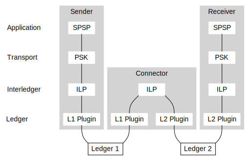
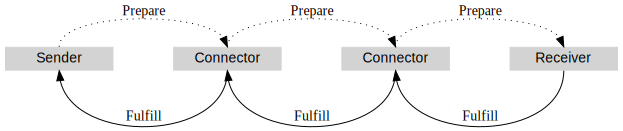
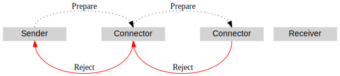

# Interledger Architecture

Interledger provides for secure payments across multiple assets on different ledgers. The architecture consists of a conceptual model for interledger payments, a mechanism for securing payments, and a suite of protocols that implement this design.

The [Interledger Protocol (ILP)](#interledger-layer) is the core of the Interledger protocol suite. Colloquially, the whole Interledger stack is sometimes referred to as "ILP". Technically, however, the Interledger Protocol is only one layer in the stack.

Interledger is not a blockchain, a token, nor a central service. Interledger is a standard way of bridging financial systems. The Interledger architecture is heavily inspired by the Internet architecture described in [RFC 1122](https://tools.ietf.org/html/rfc1122), [RFC 1123](https://tools.ietf.org/html/rfc1123) and [RFC 1009](https://tools.ietf.org/html/rfc1009).

## Core Concepts

### The Interledger

The "Interledger protocol suite" can be used among any network of participants, public or private. There is no single network that all parties must connect to to use these protocols.

"The Interledger" is the name of a public instance of the Interledger protocol suite which seeks to provide a coherent global financial infrastructure. Ideally, anyone connected to the Interledger should be able to transact with anyone else, each using the underlying systems and currencies of their choice.

### Sender, Receiver, Connectors

When two parties want to do business online, the one who sends money is the _sender_ and the one who gets money is the _receiver_. If the sender and the receiver don't have some monetary system in common, they need one or more parties to connect them. In the Interledger architecture, _connectors_ forward money through the network until it reaches the receiver.

Within these specifications, we use _node_ as a general term for any participant in the Interledger. A node may be a sender, a receiver, or a connector. The node may represent a person or business, or perhaps a single device or software program. In the case where a node represents a device or software program, the node is usually connected to another node that represents the device's owner or the person running the software.

You can envision the Interledger as a graph where the points are individual nodes and the edges are _accounts_ between two parties. Parties with only one account can send or receive through the party on the other side of that account. Parties with two or more accounts are _connectors_, who can facilitate payments to or from anyone they're connected to.

Connectors provide a service of forwarding packets and relaying money, and they take on some risk when they do so. In exchange, connectors can charge fees and derive a profit from these services. In the open network of the Interledger, connectors are expected to compete among one another to offer the best balance of speed, reliability, coverage, and cost.

### Protocol Layers

Like the Internet protocol stack that inspired it, the Interledger protocol suite is divided into layers of protocols with different responsibilities. Lower-level protocols provide basic functionality that higher-level protocols depend on to provide more complex functionality.

> **Aside:** Not pictured in the diagram are configuration protocols including [IL-RFC-31: Interledger Dynamic Configuration Protocol](../0031-dynamic-configuration-protocol/0031-dynamic-configuration-protocol.md) and **Route Broadcasting Protocol**. These protocols are built on top of the Interledger Protocol layer and support it, but are not considered to be transport or application-layer protocols.

<!-- TODO: Add a link to [RBP](https://github.com/interledger/rfcs/pull/455)'s final location. -->

The following sections describe the general functions of each layer in the protocol suite. For an alternate explanation with detailed depictions of the protocols' data formats, see [IL-RFC-33: Relationship Between Protocols](../0033-relationship-between-protocols/0033-relationship-between-protocols.md).

#### Ledger Protocols

The Interledger protocol suite sits atop a level which we call "ledger protocols". This level represents the existing money systems that Interledger connects. Even though they are not strictly part of the Interledger protocol suite, they are an indispensable part of the Interledger model.

As payments flow between two nodes using the Interledger protocol, their obligations increase and occasionally offset one another. Before the outstanding balance reaches the limit of what the nodes are willing to sustain, they need to _settle_ those balances in some money system they have in common.

For purposes of Interledger, we call all settlement systems _ledgers_. These can include banks, blockchains, peer-to-peer payment schemes, automated clearing house (ACH), mobile money institutions, central-bank operated real-time gross settlement (RTGS) systems, and even more.

Thus, before doing business using Interledger, each pair of participants must choose a way to settle their obligations, and establish limits for how much money they are willing to be owed for how much time before settling. The details of this agreement do not matter to the rest of Interledger as long they hold to one rule:

**Settlement for one account MUST NOT depend on the status of any other accounts.**

If settlement of one account in the Interledger is contingent on the status of another account or relationship, this could create the threat of cascading risks and failures, similar to problems that occurred during the 2008 global financial crisis. Nodes can protect themselves from such risks by choosing to use settlement technologies such as collateralized payment channels where available. These types of arrangements can provide high-speed settlement without a risk that the other side may not pay. For more information on different ledger types and settlement strategies, see [IL-RFC-22: Hashed Timelock Agreements](../0022-hashed-timelock-agreements/0022-hashed-timelock-agreements.md).

Nodes can also choose never to settle their obligations. This configuration may be useful when several nodes representing different pieces of software or devices are all owned by the same person or business, and all their traffic with the outside world goes through a single "home router" connector. This is the model of [moneyd](https://github.com/interledgerjs/moneyd), one of the current implementations of Interledger.

Most implementations of Interledger use a plugin architecture to settle obligations automatically while abstracting the differences between different ledger layer protocols. For an example of this, see [IL-RFC-24: JavaScript Ledger Plugin Interface version 2](../0024-ledger-plugin-interface-2/0024-ledger-plugin-interface-2.md).

#### Link Protocols

Peers in the Interledger Protocol require a way to communicate securely with one another. Since most existing ledgers do not implement two-way authenticated communication between account holders, we need Link protocols to provide this functionality. Link protocols generally convey two types of information:

- Packets of Interledger Protocol data.
- Information on the settling of outstanding balances.

[IL-RFC-23: Bilateral Transfer Protocol](../0023-bilateral-transfer-protocol/0023-bilateral-transfer-protocol.md) defines a link-layer protocol that communicates this information over [WebSocket](https://tools.ietf.org/html/rfc6455) and is compatible with a wide range of underlying ledgers.

The implementation of a Link protocol may be incorporated into a ledger plugin, since the Link protocol has to communicate settlements that occur in the underlying ledger.

#### Interledger Protocol

The Interledger Protocol version 4 (ILPv4) is the core protocol of the entire Interledger Protocol suite. This protocol's packets pass through all participants in the chain: from the sender, through one or more connectors, to the receiver. This protocol is compatible with any variety of currencies and underlying ledger systems.

This level is concerned with currency amounts, routing, and whether each step in a payment arrives in time or expires. This protocol finds a path to connect a sender and receiver using any number of intermediaries. The packets that are relayed across this path contain a cryptographic _condition_ whose _fulfillment_ is only known to the recipient (and possibly the sender). If everything goes well and the receiver wants the funds, the receiver provides the fulfillment, which triggers the funds to move at each account in the path. In this way, the fulfillment proves that the money was delivered to the intended recipient.

This layer abstracts the layers above and below it from one another, so there can be only one protocol at this layer. Other protocols, including older versions of the Interledger Protocol, are incompatible. The current protocol is defined by [IL-RFC-27: Interledger Protocol version 4](../0027-interledger-protocol-4/0027-interledger-protocol-4.md).

#### Transport Protocols

Transport layer protocols are used for **end-to-end communication** between sender and receiver; connectors are not expected to be involved. This layer is responsible for:

- Defining the condition and fulfillment that are used on the Interledger Protocol layer
- Grouping and retrying packets to achieve a desired outcome
- Determining the effective exchange rate of a payment
- Adapting to the speed at which packets can be sent, for what amounts
- Encrypting and decrypting data

For an example, see the STREAM protocol, defined by [IL-RFC-29: STREAM](../0029-stream/0029-stream.md). STREAM creates a bidirectional connection between a sender and receiver that consists of many individual Interledger packets.

#### Application Protocols

Protocols at the application level communicate details outside of the minimum information that is technically necessary to complete a payment. For example, application protocols may check that participants are interested in conducting a transaction and are legally allowed to do so.

Protocols on this layer are responsible for:

1. Destination account discovery ("Where should the money be sent, exactly?")
2. Destination amount negotiation ("Is it OK if this much arrives after fees and exchange rates?")
3. Transport protocol selection and communication of associated details ("Are we using STREAM? What shared secret should we use?")
4. Optionally, any other information that should be communicated in ILP packet data. ("Use this invoice identifier to credit the payment to your video subscription.")

An example of an application layer protocol is the [Simple Payment Setup Protocol (SPSP)](../0009-simple-payment-setup-protocol/0009-simple-payment-setup-protocol.md), which communicates the destination ILP address and related details over HTTPS, and uses STREAM as the transport layer protocol.

Many different messaging protocols can be defined on and above the Application level of the Interledger clearing system.

#### Comparison to Traditional Financial Infrastructure

The layers of Interledger are similar to the different layers of traditional inter-bank systems:

- Interledger's _Application_ layer serves a similar purpose as _messaging_ in banking terms.
- Interledger's _Transport_ and _Interledger_ layers combined are similar to a _clearing_ system in banking, though there are some differences. (For more details, see [IL-RFC-32: Peering, Clearing, and Settling](../0032-peering-clearing-settlement/0032-peering-clearing-settlement.md).)
- Interledger's _Link protocols_ don't have a direct banking equivalent, but they provide authenticated messaging to enable the Interledger Protocol layer, and they also associate settlement events in the underlying ledgers to balances in the Interledger Protocol layer.
- The underlying _Ledger_ systems are equivalent of _settlement_ in banking terms.

### Interledger Protocol Flow

Interledger moves money by relaying _packets_. In the Interledger Protocol, a "prepare" packet represents a possible movement of some money and comes with a condition for releasing it. As the packet moves forward through the chain of connectors, the sender and connectors prepare balance changes for the accounts between them. The connectors also adjust the amount for any currency conversions and fees subtracted.

When the prepare packet arrives at the receiver, if the amount of money to be received is acceptable, the receiver fulfills the condition with a "fulfill" packet that confirms the balance change in the account between the last connector and the receiver. Connectors pass the "fulfill" packet back up the chain, confirming the planned balance changes along the way, until the sender's money has been paid to the first connector.

At any step along the way, a connector or the receiver can reject the payment, sending a "reject" packet back up the chain. This can happen if the receiver doesn't want the money, or a connector can't forward it. A prepared payment can also expire without the condition being fulfilled. In all these cases, no balances change.

The flow is specified in detail in [IL-RFC-27: Interledger Protocol version 4](../0027-interledger-protocol-4/0027-interledger-protocol-4.md).

#### Packetized Money

A packet does not have to represent the full amount of a real-world payment. _Transport protocols_ built on top of the Interledger Protocol can combine many small-value packets into a single large-value payment, rejecting and retrying individual packets as necessary to achieve the desired outcome. Using small packets (in terms of the amount of money represented, not the data size) in this way has several benefits for the network:

- Small packets reduce the "free option problem" where senders can lock up connectors' funds, then either take the promised deal or not depending on whether exchange rates move in their favor.
- Small packets involve small connectors (those with less funds available) in more transactions, and lower the barrier to entry for operating a connector, since moving less than the full amount of a payment can still be useful.
- Small packets let participants settle their balances more often, so that the outstanding balance between two participants can remain low even when sending large payments.

The Interledger Protocol does not have a specific definition of "small", nor a size limit on packets. Each connector can choose minimum and maximum packet sizes they are willing to relay; as a result, any path's maximum packet size is the smallest maximum packet size among the connectors in that path. To be compatible with as much of the network as possible, one should choose packet sizes that fit between the minimum and maximum values of as many connectors as possible.

### Addresses

_Interledger addresses_ (also called _ILP addresses_) provide a universal way to address senders, receivers and connectors. These addresses are used in several different protocol layers, but their most important feature is to enable routing on the Interleder Protocol layer. Interledger addresses are hierarchical, dot-separated strings where the left-most segment is most significant. An example address might look like:
`g.us.acmebank.acmecorp.sales.199` or `g.crypto.bitcoin.1BvBMSEYstWetqTFn5Au4m4GFg7xJaNVN2`.

For more information on the format of ILP addresses and how they apply to routing, see [IL-RFC-15: ILP Addresses](../0015-ilp-addresses/0015-ilp-addresses.md).

If two parties in the Interledger have a "parent/child" connection rather than a peer-to-peer connection, the child can request an Interledger address that is under the parent's address in the hierarchy. For more information, see [IL-RFC-31: Interledger Dynamic Configuration Protocol (ILDCP)](../0031-dynamic-configuration-protocol/0031-dynamic-configuration-protocol.md).

## Interledger Security

**Interledger uses *conditional transfers* to secure payments across multiple hops and even through untrusted connectors.** Everyone only needs to trust their direct peers, no matter how many connectors are involved in forwarding a given packet. Connectors take some risk, but this risk can be managed and is primarily based upon the connector's chosen peers.

> **Hint:** Conditional transfers or *authorization holds* are the financial equivalent of a [two-phase commit](http://foldoc.org/two-phase%20commit).

Because each party is isolated from risks beyond their immediate peers, longer paths are not inherently more risky than shorter paths. This enables longer paths to compete with shorter paths to convey money from any given sender to any given receiver, while reducing the risk to the sender.

The original Interledger whitepaper presented an _atomic mode_ with a stronger guarantee of atomicity, but implementing atomic mode requires extra agreements that cannot be generalized to an open network. The specifications in the Interledger protocol suite are concerned with what the whitepaper calls _universal mode_.

### Conditions and Fulfillments

Interledger uses the digest of the [SHA-256](https://en.wikipedia.org/wiki/SHA-2) hash function as the condition for prepare packets. (This choice was inspired by the design of the [Lightning Network](http://lightning.network).) The fulfill packet contains a valid 32-byte preimage for the hash specified in the prepare packet. Connectors are responsible for validating fulfillments in the Interledger Protocol layer.

The sender and receiver for a payment define the condition and fulfillment for each packet using a [Transport Layer](#transport-layer) protocol.

### Connector Risk and Mitigation

Interledger connectors accept some risk in exchange for the revenue they generate from facilitating payments. In the Interledger payment flow, connectors incur outgoing obligations on the receiver-side account, before they become entitled to incoming obligations on the sender-side account. After each connector receives a `fulfill` packet, they have a window of time to deliver the `fulfill` packet to their counterparty on the sender-side account. Connectors that fail to deliver the `fulfill` packet in time may lose money.

If some connectors in the path of an Interledger packet receive the `fulfill` packet in time and others don't, the receiver will know the packet was received but the sender will not know. Usually, a single Interledger packet is part of a larger transaction or payment stream, so the sender may find out what happened when they receive the response for the next packet. Senders MAY also retry packets that expire. The exact behavior of senders and receivers with respect to retries is defined by the transport layer. For an example, see [IL-RFC-29: STREAM](../0029-stream/0029-stream.md) for a description of the STREAM transport layer protocol.

Failing to deliver the `fulfill` packet in time is the main risk connectors face and there are a number of additional strategies connectors should employ to mitigate and manage this risk. For more details, see [IL-RFC-18: Connector Risk Mitigations](../0018-connector-risk-mitigations/0018-connector-risk-mitigations.md).
