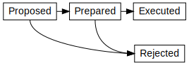

# Interledger Architecture

This document outlines the Interledger architecture and explains how the different layers relate to each other.

The Interledger architecture is heavily inspired by the Internet architecture described in [RFC 1122](https://tools.ietf.org/html/rfc1122), [RFC 1123](https://tools.ietf.org/html/rfc1123) and [RFC 1009](https://tools.ietf.org/html/rfc1009).

**This is a strawman proposal.** Choices made in this document are merely intended as a starting point.

## Introduction

This document is intended to provide an overview over the Interledger architecture and protocol suite.

## The Interledger Architecture

All electronic transfers have to be recorded in stateful systems. Otherwise the same instance of an asset could be sent to two different destinations, essentially duplicating the asset. This is also known as a double-spend. We call these stateful systems *ledgers*.

Ledgers consist of *accounts*. Accounts are individual buckets containing a decimal amount of one type of asset, usually (but not always) associated with an owner. This amount is also called the account's *balance*. Balances can be positive or negative, representing assets or liabilities.

Assets can be transferred between accounts on the same ledger. We call these events *book transfers* or just *transfers*.

A transfer of assets across ledgers requires two or more local book transfers. Some system must know the relationship between the two transfers. We call this system a *connector*. The same system may act as both a ledger and a connector.

The Interledger is a network of independent and diverse ledgers. Each account is part of a particular ledger; the Interledger itself is only conceptual.

### Architectural Assumptions

#### Ledgers contain only one type of asset.

We assume that all assets within one ledger are fungible. Within one ledger transfers can happen directly from sender to recipient and do not require a third party exchanger.

When a single organization such as a bank manages accounts in multiple different assets of different types, we treat each asset as belonging to its own ledger.

#### Connectors do not keep transfer state information.

Just as Internet gateways do not keep connection state information, connectors do not keep transfer state information. All state is kept at the ledger level and connectors merely react to and trigger ledger events.

Note that this does not mean that all connectors are necessarily stateless. They may keep track of their available liquidity or even maintain an internal ledger if they are transacting on behalf of third parties. But we are assuming that they do not keep authoritative state about transfers.

#### Routing complexity should be in the connectors.

Routing is a complex and difficult problem, and ought to be performed by the connectors, not the end users of the system. An important objective is to isolate user software from changes caused by the inevitable evolution of the Interledger routing architecture.

#### The system must tolerate wide ledger variation.

A basic objective of the Interledger design is to tolerate a wide range of ledger characteristics --- e.g. throughput, latency, fees, access restrictions, reliability, decentralization. In addition it must support all types of different asset characteristics --- e.g. divisibility, fungibility, interest/demurrage, issuance.

### Interledger Protocol Suite

The Interledger architecture is separated into four layers:

#### Application Layer

The application layer is the top layer of the Interledger protocol suite. Protocols on this layer are responsible for negotiating the key properties of a payment:

* Source Account
* Destination Account
* Amount

Once these parameters are decided, the application layer protocol will instantiate a transport layer protocol to initiate the payment.

An example of an application layer protocol is the [Simple Payment Setup Protocol (SPSP)](#simple-payment-setup-protocol-spsp).

#### Transport Layer

The transport layer is responsible for two things:

* Generating the condition
* Encoding (e.g. encrypting) the application layer data

There are currently two transport layer protocols:

* [Privately Shared Key (PSK)](#privately-shared-key-psk)

  A key is shared between sender and recipient, which is used to generate the condition and encrypt the application data.

* [Interledger Payment Request (IPR)](#interledger-payment-request-ipr)

  The condition is generated by the recipient and the fulfillment is not known to the sender until the execution of the payment. This is useful for building non-repudiable application layer protocols.

#### Interledger Layer

All Interledger transport protocols use the [Interledger Protocol (ILP)](#interledger-protocol-ilp) to communicate with connectors about transfer requests. This may include requesting a quote or requesting a transfer on another ledger.

The Interledger layer defines a standard way to refer to ledgers, accounts and amounts. This is used in routing as well as to try and make quotes comparable.

#### Ledger Layer

In order to facilitate transfers between accounts, ledgers must implement some API or protocol. This is called the ledger layer. There is a wide variety of ledger layer protocols, corresponding to the many different types of ledger.

## Ledger Layer

### Introduction

Ledger protocols are responsible for executing the individual transfers that constitute an Interledger transaction. They are also used by connectors to communicate with each other. Ledger layer protocols can differ widely depending on the type of ledger. For example, a central ledger will likely use a very different protocol than a blockchain, but for interledger purposes they are both ledgers and may be accessed using the same primitive operations as defined in this architecture.

### Requirements

#### Minimal Support

For minimal Interledger support, the ledger MUST have the ability for funds to be transferred from one account to another. All of the more advanced ledger layer functionality, such as escrowed transfers, messaging, etc. can be implemented on top of this type of basic ledger.

#### Basic Support

For basic Interledger support, a ledger MUST fulfill the requirements for minimal support and also the following:

The ledger MUST provide cryptographic authorization holds. During an authorization hold, money is put aside for a specific transfer until that transfer's outcome has been decided.

Transfers using authorization holds can be in four distinct states:

* Proposed -- Nothing has happened yet.
* Prepared -- Funds are held.
* Executed -- The transfer has completed.
* Rejected -- The transfer has been canceled (and funds returned to the sender.)

**Hint:** Authorization holds are the financial equivalent of a [two-phase commit](http://foldoc.org/two-phase%20commit).

The ledger MUST be able to release the held funds to the receiver upon receiving a 32-byte preimage whose SHA-256 hash matches a value provided by the sender. It MUST also support releasing the funds back to the sender after a timeout.

The ledger MUST support attaching a short message or *memo* to each transfer.

#### Full Support

The ledger MUST fulfill the requirements for basic support and also the following:

It MUST support memos up to 65535 bytes.

It MUST support sending an authenticated message of up to 65535 bytes to the holder of another account on the ledger.

It MUST support a way to look up a fulfillment by condition hash. It SHOULD automatically reject new transfers (that have not been prepared yet) that have an execution condition for which the ledger already knows the fulfillment. This aids in [error recovery](#error-recovery).

### Example Protocols

#### Five Bells Ledger Protocol (5BLP)

Five Bells Ledger Protocol (5BLP) is a RESTful, JSON-based protocol that was developed specifically to provide the minimum functionality required for full Interledger support.

A reference implementation of a ledger using 5BLP can be found [here](https://github.com/interledger/five-bells-ledger).

#### Blockchain Protocols (e.g. Bitcoin)

Blockchains are distributed, peer-to-peer systems that provide consensus over a single shared state. Any blockchain that supports escrowed funds transfers is in principle capable of acting as a ledger connected to the Interledger.

Bitcoin for instance supports multiple credits and debits as well as SHA-256 hashlocked escrow transfers which means it can participate in OTP/ILP and UTP/ILP Interledger transactions. Bitcoin's BIP-65 enhancement proposal provides the timeouts required for Basic level support.

#### Legacy Protocols (e.g. ACH, ISO 20022)

Legacy protocols often do not provide escrow functionality. In this case, the protocol can either be upgraded, or a highly trusted participant (e.g. a bank) can act as an escrow provider.

#### Proprietary Wallet Protocols (e.g. PayPal API)

There are large numbers of proprietary ledgers out there. This includes web-based and mobile wallets. These types of systems can usually be extended with cryptographic escrow functionality by their operator in order to connect them to the Interledger.

#### Other Proprietary Protocols (e.g. Skype API)

Some proprietary protocols intentionally do not provide general ledger functionality. A common example are stored-value systems, such as gift cards, loyalty points or pre-paid accounts. Such systems can still be connected to the Interledger in a limited capacity. For example a pre-paid account ledger could be set up to act as a receiving ledger, but not as a sending or intermediate ledger.

By creating two classes of users -- resellers and end users -- and only allowing transfers if the sender is a reseller and the recipient is a user, merchants can create Interledger-capable ledgers which behave like stored-value systems. Such systems allow deposits, but do not allow withdrawals.

## Interledger Layer

### Introduction

The Interledger Protocol (ILP) ensures that different connectors are interoperable and can work together to route transactions.

### Protocols

#### Interledger Protocol (ILP)

When initiating an Interledger transaction, the sender will make a transfer to a connector using their local Ledger layer protocol. Within this transfer, the sender will include an [ILP Packet](../0003-interledger-protocol/) which tells the receiving connector the final destination, the amount to be transferred and -- if applicable -- the condition.

Note that the exact method of transmitting this data packet is dependent on the ledger layer protocol. Typically, it will be included in the transfer in a memo field. However, some ledgers may specify a different method for transporting the ILP packet.

The protocol flow is described in the [Interledger whitepaper](https://interledger.org/interledger.pdf).

**Note:** Interledger only supports Universal mode as described in the whitepaper. Atomic mode can be used by adjacent subsets of participants in an Interledger payment if desired, however this is not part of the standard.

##### Error Recovery

An ILP execution chain can be interrupted if a connector fails to deliver the condition fulfillment. In that case the sender will think that the transaction failed and retry it. While retrying, some connector will try to create a prepared transfer on a ledger which already knows the corresponding fulfillment, which will cause the request to fail. The connector will notice this and simply pass back the fulfillment without paying anything.

In other words, the failed connector will lose money and some other connector will win money, but from the sender and recipient's point of view everything has executed normally.

#### Interledger Quoting Protocol (ILQP)

Before an Interledger transfer takes place, the sender will request quotes from connectors which are connected to the same ledger. These quote requests happen via the [Interledger Quoting Protocol (ILQP)](../0008-interledger-quoting-protocol/).

Senders MAY cache quotes and send repeated transfers through the same connector.

## Transport Layer

### Introduction

Transport layer protocols are responsible for coordinating the different transfers that make up an Interledger transaction. The safety guarantees afforded to the participants of a transaction vary depending on the type of transport protocol used.

### Protocols

#### Privately Shared Key (PSK)

**TODO:** Describe PSK.

#### Interledger Payment Request (IPR)

**TODO:** Describe IPR.

## Application Layer

### Introduction

Application layer protocols deal with the exchange of payment details and associated negotiation.

### Simple Payment Setup Protocol (SPSP)

The Simple Payment Setup Protocol (SPSP) is an application layer protocol for negotiating payment details. SPSP handles account and amount discovery, condition creation, quoting and setup. SPSP uses Webfinger ([RFC 7033](https://tools.ietf.org/html/rfc7033)) and an HTTP-based protocol for querying account and amount details, [ILQP](#interledger-quoting-protocol-ilqp) for quoting, and [ILP](#interledger-protocol-ilp) for payment execution.

The protocol is described in [IL-RFC 9](../0009-simple-payment-setup-protocol/).

### Defining Other Application Layer Protocols

Creators of other application layer protocols should consider the following:

1. Account discovery
2. Amount and condition communication
3. Additional details communicated in memo
4. Condition types supported or required
5. Transport protocol
6. Incoming payment validation (amount, condition, etc.)
