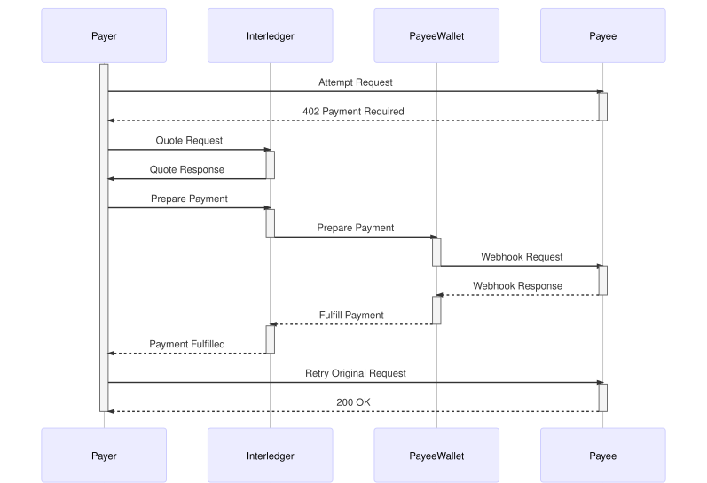

# HTTP-ILP

> A standard for paid HTTP requests.

# Design Goals

Design a protocol to pay for HTTP requests.

Criteria:

* Minimum number of roundtrips
* Hashing only (no asymmetric crypto) for simplicity and performance
* Interaction with HTTP server is via HTTP (actually HTTPS) calls only - we want to tie into the existing load balancing and security infrastructure (HTTPS), no need to run any JavaScript/Websocket client on the HTTP server or other shenanigans

Below is a complete description of the protocol. Note that documentation for app developers would be much simpler since it would only describe the two endpoints they need to think about (webhook handler to increment balance and payment middleware to check and decrement balance)

# Flows

## 1. Setup

###### Scenario

**Ankita** is a *server admin* who owns a file hosting service at `myservice.example` and would like to provide an API where her users can upload files without having to register first. In order to enable this in a standards-compliant way, she decides to use HTTP-ILP.

### 1.1. Server admin installs an ILP payment module

After deciding to use HTTP-ILP, Ankita searches the web on instructions on how to set this up. She finds an open-source HTTP-ILP server module which is compatible with the REST framework ([Koa](https://koajs.com)) that she is already using.

She installs the HTTP-ILP server module. The module provides middleware which she adds to the different API endpoints in order to set prices for each one.

The module also adds a new payment webhook endpoint to her API. After the installation is complete, the software tells her the URI for the webhook endpoint:

* Payment Webhook URI: `https://myservice.example/webhook`

According to the documentation of the HTTP-ILP server module, she learns that she should now go to her ILP wallet provider and set up a receiver using this webhook URI.

### 1.2. Server admin sets up a new receiver

Ankita uses the web-based UI of her ILP wallet provider to create a new receiver tied to her account. She chooses an arbitrary unique (for her account) `name` to identify this receiver and enters the `webhook` URI from the previous step which points to her `myservice.example` server. Internally, the UI makes a call to the wallet provider's backend:

###### Request

``` http
POST /api/receivers
Host: nexus.justmoon.com
Content-Type: application/json
```
``` js
{
  "name": "filepay",
  "webhook": "https://myservice.example/webhook"
}
```

###### Response

``` js
{
  "name": "filepay",
  "webhook": "https://myservice.example/webhook",
  "secret": "fxPERNaS4FGlC8H7eg6UfYVlglmFynFc8nh5la9PBGM"
}
```

Afterwards, the UI shows Ankita the receiver address and secret:

* SPSP Receiver Address: `ankita+filepay@nexus.justmoon.com`
* SPSP Receiver Secret: `fxPERNaS4FGlC8H7eg6UfYVlglmFynFc8nh5la9PBGM`

This secret will henceforth be referred to as the *receiver secret* / `receiver_secret`.


### 1.3. Server admin enters credentials into the HTTP-ILP server module config

Next, Ankita logs back into her server and edits a config file of the HTTP-ILP server module to enter the receiver address and secret she obtained:

``` ini
[spsp_creds]
receiver_address=ankita+filepay@nexus.justmoon.com
receiver_secret=fxPERNaS4FGlC8H7eg6UfYVlglmFynFc8nh5la9PBGM
```

Next, she restarts her server to load the new configuration.

### 1.4. Paid HTTP server fetches receiver information

When the HTTP-ILP server module loads up, it uses [Webfinger](https://tools.ietf.org/html/rfc7033) to look up the `receiver_address` from the configuration.

###### Request
``` http
GET /.well-known/webfinger?uri=ankita+filepay@nexus.justmoon.com
Host: nexus@justmoon.com
```

The wallet will generate an ILP address using its ledger prefix, the fixed term `~recv`, the username `ankita` and the receiver name `filepay`.

* ILP Address: `us.nexus.ankita.~recv.filepay`

Note that the method for mapping an SPSP address to an ILP address is totally arbitrary and not part of this standard. The wallet MAY do this any way that it wants. In practice, the wallet may choose an address not including the username for privacy reasons.

###### Response
``` http
HTTP/1.1 200 OK
Content-Type: application/json
```
``` js
{
  // TODO ...
}
```

The HTTP-ILP server module now knows the ILP address and caches it in memory for a certain period (depending on the cache header of the above request.) The reason we had Ankita enter the SPSP address and not the ILP address is because the ILP address may change over time as ILP providers change their routing structure. Note that ILP may support multihoming (this is still being debated as of this writing), so there may also be more than one ILP address.

This completes the setup process. The server is now ready to receive paid API requests.

## 2. Client interaction

###### Scenario

**Marat** is a *graphic designer* who would like to upload a mockup image to share with a client. His friend recommended a tool which doesn't require any signup or configuration and uses his existing ILP account to pay for the storage and bandwidth fees.



### 2.1. Client generates a server-specific token from the hostname and its local secret:

The uploader tool contains an HTTP-ILP client module. This client module has already generated and locally saved a `client_secret` using 256 bits of cryptographically secure randomness.

Before making the paid HTTP request, the HTTP-ILP client module generates a **token** using the `hostname` of the server it is about to make a request to:

* Token: `HMAC(SHA256, client_secret, hostname)`

### 2.1. Client attempts to call API using token

The paid HTTP request is fired off:

``` http
POST /upload HTTP/1.1
Host: myservice.example
X-Pay-Token: 7y0SfeN7lCuq0GFF5UsMYZofIjJ7LrvPvsePVWSv450
```
```
[...]
```

Note that the client hasn't paid at this point and is only making the request to solicit a response from the server.

### 2.2. Server rejects request, because token is new and unfunded

The server returns an HTTP error of `402 Payment Required` and includes response headers showing the amount (how much the request would have cost), an ILP address and a condition seed.

``` http
HTTP/1.1 402 Payment Required
X-Pay: 10 us.nexus.ankita.~recv.filepay SkTcFTZCBKgP6A6QOUVcwWCCgYIP4rJPHlIzreavHdU
X-Pay-Balance: 0
```

The client may use the condition seed to create a condition to pay this host. The condition seed is generated by the server as follows:

* Condition Seed: `HMAC(SHA256, receiver_secret, token)`

The condition_seed is now a shared secret between the client and server, but will be unknown to any third-party connectors between them.

That means that if the payment fails, the client can blame the server (assuming it considers itself honest and not compromised.) The client can't prove any wrongdoing to a third party, but since amounts are likely to be very low, this probably wouldn't be worth doing anyway. Also, proving wrongdoing would also involve proving that the server did not provide the agreed-upon service, which is probably near impossible in most cases anyway. However, since it can detect malicious behavior, the client can blacklist malicious hosts and not deal with them in the future.


### 2.3. Client initiates an ILP payment to refill its balance

In order to refill its balance, the client now creates an ILP payment with the following properties:

* Destination: `us.nexus.ankita.~recv.filepay`
* Amount: `100`
* Condition: `SHA256(fulfillment)`
* Memo: `pay_token`

The `fulfillment` is generated as:

* Fulfillment: `HMAC(SHA256, condition_seed, destination_account || destination_amount)`

When the prepared payment reaches the receiving wallet, the webhook that is registered with the ankita+filepay@nexus.justmoon.com receiver is triggered. Note that the wallet does not fulfill the payment yet.

### 2.4. Wallet POSTs a payment notification

``` http
POST /webhook
Host: myservice.example
Content-HMAC: sha256 T8grJq7LR9KGjE7741gXMqPny8xsLvsyBiwIFwoF7rg
Content-Type: application/json
```
``` js
{
  "id": "ad243387-5fbf-4d0e-90a9-b56f0f5c1ec6",
  "receiver": "ankita+filepay@nexus.justmoon.com",
  "amount": "100",
  "token": "7y0SfeN7lCuq0GFF5UsMYZofIjJ7LrvPvsePVWSv450",
  "condition": "P9ujXwTcjEYphsmSvPh1VGJXETByqQnBYvfkcOWB4ng",
  "timestamp": "2017-01-16T04:43:33.892Z"
}
```

`Content-HMAC` is an [HMAC request signature](http://progrium.com/blog/2012/12/17/http-signatures-with-content-hmac/) of the request body using the `receiver_secret` as the key.

* Signature: `HMAC(SHA256, receiver_secret, raw_http_body)`

The HTTP-ILP server module MUST verify the signature. It MAY rely on TLS to protect against replay attacks, but if possible it SHOULD keep a list of used `id`s for a suitable time period (e.g. two minutes) and check that `timestamp` falls within that period.

The HTTP-ILP server module MUST generate the fulfillment using the same algorithm that the client used in step 2.3. It will then respond with this fulfillment if it has successfully processed the payment.

``` http
HTTP/1.1 200 OK
Content-Type: application/json
```
``` js
{
  "fulfillment": "5in6ZZjXMnaPfHJrS2IShfnDuFMDkAqpEgF9t2F9i9s"
}
```

There is a chance that the HTTP-ILP server module will process the payment, but the fulfillment will not be processed in time due to some latency or outage. We think that most operators would want to take the risk as a benefit for their users. However, they have the option of choosing a wallet which will process the fulfillment immediately before sending the webhook. Theoretically, that version of flow creates a race condition: If the fulfillment reaches the sender and the sender makes a request before the webhook reaches the server, then the server may incorrectly report the previous balance. That's another reason why it is preferable that the server take the risk.

### 2.5. Wallet fulfills the incoming payment

Having received a positive response to the webhook, the wallet will go ahead and use the fulfillment returned to fulfill the incoming transfer.

### 2.6. Sender/client receives the fulfillment.

Once the HTTP-ILP client module receives the fulfillment, it will now retry its original request:

``` http
POST /upload HTTP/1.1
Host: myservice.example
X-Pay-Token: 7y0SfeN7lCuq0GFF5UsMYZofIjJ7LrvPvsePVWSv450
```
```
[...]
```

This time, the request succeeds:

``` http
HTTP/1.1 200 OK
X-Pay: 10 us.nexus.ankita.~recv.filepay SkTcFTZCBKgP6A6QOUVcwWCCgYIP4rJPHlIzreavHdU
X-Pay-Balance: 90
```

Notice how the 100 units credit from the payment was added to the balance and the 10 unit cost for the current request was subtracted.
