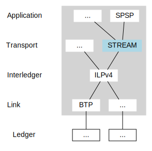

# STREAM: A Multiplexed Money and Data Transport for ILP

## Abstract

This document specifies the STREAM Interledger Transport protocol, which provides for reliably sending money and data over ILP. STREAM is designed to be used in applications that involve streaming payments or data, as well as those that require sending larger discrete payments and messages. A virtual connection is established between a "client" and a "server" and can be used to send authenticated ILP packets between them.

**Table of Contents:**

- [STREAM: A Multiplexed Money and Data Transport for ILP](#stream-a-multiplexed-money-and-data-transport-for-ilp)
  - [Abstract](#abstract)
  - [1. Introduction](#1-introduction)
  - [2. Conventions and Definitions](#2-conventions-and-definitions)
  - [3. Overview](#3-overview)
    - [3.1. Relationship with Other Protocols](#31-relationship-with-other-protocols)
    - [3.2. Why Streams?](#32-why-streams)
    - [3.3. Multiplexed Streams](#33-multiplexed-streams)
    - [3.4. Exchange Rates](#34-exchange-rates)
    - [3.5. Packets and Frames](#35-packets-and-frames)
    - [3.6. Packet Acknowledgements (ACKs)](#36-packet-acknowledgements-acks)
  - [4. Life of a Connection](#4-life-of-a-connection)
    - [4.1. Setup](#41-setup)
    - [4.2. Matching Packets to Connections](#42-matching-packets-to-connections)
    - [4.3 Connection Details](#43-connection-details)
      - [4.3.1. Client Address Communication](#431-client-address-communication)
      - [4.3.2. Connection Migration](#432-connection-migration)
      - [4.3.3. Connection Asset Details](#433-connection-asset-details)
    - [4.4. Streams](#44-streams)
      - [4.4.1. Opening New Streams](#441-opening-new-streams)
      - [4.4.2. Sending Money](#442-sending-money)
      - [4.4.3. Sending Data](#443-sending-data)
      - [4.4.4. Stream-Level Flow Control](#444-stream-level-flow-control)
      - [4.4.5. Closing Streams](#445-closing-streams)
    - [4.5. Connection-Level Flow Control](#45-connection-level-flow-control)
    - [4.6. Closing Connections](#46-closing-connections)
  - [5. Packet and Frame Specification](#5-packet-and-frame-specification)
    - [5.1. Encryption](#51-encryption)
      - [5.1.1. Encryption Envelope](#511-encryption-envelope)
      - [5.1.2. Encryption Pseudocode](#512-encryption-pseudocode)
      - [5.1.3. Maximum Number of Packets Per Connection](#513-maximum-number-of-packets-per-connection)
      - [5.1.4. Maximum `VarUInt` Size](#514-maximum-varuint-size)
    - [5.2. STREAM Packet](#52-stream-packet)
    - [5.3. Frames](#53-frames)
      - [5.3.1. `ConnectionClose` Frame](#531-connectionclose-frame)
      - [5.3.2. `ConnectionNewAddress` Frame](#532-connectionnewaddress-frame)
      - [5.3.3. `ConnectionMaxData` Frame](#533-connectionmaxdata-frame)
      - [5.3.4. `ConnectionDataBlocked` Frame](#534-connectiondatablocked-frame)
      - [5.3.5. `ConnectionMaxStreamId` Frame](#535-connectionmaxstreamid-frame)
      - [5.3.6. `ConnectionStreamIdBlocked` Frame](#536-connectionstreamidblocked-frame)
      - [5.3.7. `StreamClose` Frame](#537-streamclose-frame)
      - [5.3.8. `StreamMoney` Frame](#538-streammoney-frame)
      - [5.3.9. `StreamMaxMoney` Frame](#539-streammaxmoney-frame)
      - [5.3.10. `StreamMoneyBlocked` Frame](#5310-streammoneyblocked-frame)
      - [5.3.11. `StreamData` Frame](#5311-streamdata-frame)
      - [5.3.12. `StreamMaxData` Frame](#5312-streammaxdata-frame)
      - [5.3.13. `StreamDataBlocked` Frame](#5313-streamdatablocked-frame)
      - [5.3.14. `ConnectionAssetDetails` Frame](#5314-connectionassetdetails-frame)
      - [5.3.15. `StreamReceipt` Frame](#5315-streamreceipt-frame)
    - [5.4. Error Codes](#54-error-codes)
  - [6. Condition and Fulfillment Generation](#6-condition-and-fulfillment-generation)
    - [6.1. Unfulfillable Condition](#61-unfulfillable-condition)
      - [6.2. Fulfillable Condition](#62-fulfillable-condition)
      - [6.3. Fulfillment Generation](#63-fulfillment-generation)
  - [Appendix A: Similarities and Differences with QUIC](#appendix-a-similarities-and-differences-with-quic)

## 1. Introduction

STREAM is a multiplexed Interledger Transport Protocol that provides for sending multiple "streams" of money and data between two parties using ILP. STREAM is designed to provide a flexible set of features that allow it to be used for multiple payment and messaging applications:

- Sending money and data over ILP
- Segmenting larger payments or messages into packets and reassembling them
- Bi-directional communication between two endpoints through ILP
- Stream multiplexing (sending multiple logical streams of money and/or data over a single connection)
- Stream- and connection-level flow control (adjusting the rate at which money and data are sent)
- Congestion control (adjusting the rate at which ILP packets are sent based on network throughput limits)
- Authenticating and encrypting ILP packet data
- Generating and fulfilling ILP packet conditions
- Connection migration

STREAM is a successor to the [Pre-Shared Key V2 (PSK2)](../0025-pre-shared-key-2/0025-pre-shared-key-2.md) Transport Protocol and also takes significant inspiration from the [QUIC](https://tools.ietf.org/html/draft-ietf-quic-transport-10) Internet Transport Protocol. Like PSK2, STREAM uses a shared secret to authenticate and encrypt multiple packets, as well as to generate the conditions and fulfillments. In addition, STREAM enables sending money and data in both directions between the two endpoints and automatically determines how much money and data can be sent in each ILP packet. STREAM borrows heavily from QUIC's packet format, stream multiplexing, and approach to flow control (see [Appendix A](#appendix-a-similarities-and-differences-with-quic) for similarities and differences with QUIC).

## 2. Conventions and Definitions

The key words “MUST”, “MUST NOT”, “REQUIRED”, “SHALL”, “SHALL NOT”, “SHOULD”, “SHOULD NOT”, “RECOMMENDED”, “NOT RECOMMENDED”, “MAY”, and “OPTIONAL” in this document are to be interpreted as described in BCP 14 [RFC2119](https://tools.ietf.org/html/rfc2119) [RFC8174](https://tools.ietf.org/html/rfc8174) when, and only when, they appear in all capitals, as shown here.

Definitions of terms that are used in this document:

- **Client** - The endpoint initiating a STREAM connection
- **Server** - The endpoint accepting incoming STREAM connections
- **Endpoint** - The client or server end of a connection, which can be the sender or receiver of money and/or data
- **Connection** - The session established between two endpoints that uses a single shared secret and multiplexes multiple streams of money and/or data
- **Sender** - The endpoint that sends a particular ILP Prepare packet. Because STREAM connections are bi-directional, either endpoint can be the sender of a given packet
- **Receiver** - The endpoint that receives a particular ILP Prepare packet and responds with either an ILP Fulfill or Reject packet. Because STREAM connections are bi-directional, either endpoint can be the receiver of a given packet
- **Stream** - A logical, bi-directional channel of ordered bytes and money within a STREAM connection
- **Shared Secret** - A cryptographically-secure random seed that is shared between the two endpoints comprising a connection and is used to derive keys for encrypting packets and generating conditions and fulfillments
- **STREAM packet** - A payload sent as the data portion of an ILP packet that can be parsed by a STREAM endpoint

STREAM stands for the STREAMing Transport for the Real-time Exchange of Assets and Messages.

## 3. Overview

This section provides a high-level description of key aspects of STREAM that are useful to understand before reading the full protocol outline.

### 3.1. Relationship with Other Protocols



STREAM is a Transport Protocol, designed to be used with [ILPv4](../0027-interledger-protocol-4/0027-interledger-protocol-4.md). Application Layer protocols, such as the [Simple Payment Setup Protocol (SPSP)](../0009-simple-payment-setup-protocol/0009-simple-payment-setup-protocol.md) can use STREAM to send money and data between endpoints.

### 3.2. Why Streams?

Some applications involve sending money and/or data on an ongoing basis, whereas others may deliver larger logical payments or messages. Streams provide a lightweight abstraction that can be used for either of these cases.

In an application that uses an ongoing flow of money, an endpoint can open a single stream and continue sending money on it for the duration of some paid interaction.

In another application, an endpoint can open a stream, send a specific amount of money through it, and then close the stream to indicate the payment is complete. In this case, the stream abstraction provides a mechanism to "frame" a payment or message that may be split across multiple packets. New streams can be opened and closed on the same connection to send multiple messages.

STREAM uses bidirectional streams, which can be used for request/response flows or one-way messages.

The choice of streams as the key abstraction is inspired by [QUIC](https://quicwg.github.io/base-drafts/draft-ietf-quic-transport.html#rfc.section.9) and the earlier [Structured Streams Transport (SST)](http://www.brynosaurus.com/pub/net/sst.pdf).

### 3.3. Multiplexed Streams

Each connection can include multiple streams, each of which is used to send money and/or data.

Streams are given numerical IDs. Client-initiated streams are given odd numbers starting with 1 and server-initiated streams are given even numbers starting with 2 (this is used to avoid collisions if both endpoints open streams at the same time).

Endpoints can limit the number of concurrently active incoming streams by adjusting the maximum stream ID and communicating that limit to the other endpoint using a `ConnectionMaxStreamId` frame. Implementations SHOULD use a default max stream ID of 20, which allows each endpoint to open up to 10 concurrent streams.

### 3.4. Exchange Rates

A critical function of Interledger Transport Protocols is to determine the path exchange rate and handle any changes in the rate. STREAM packets include a minimum acceptable amount in ILP Prepare packets and the amount that arrived at the other endpoint in the Fulfill or Reject packet. Senders SHOULD judge amounts and prices only in their own units using the calculated path exchange rate, because destination units can be manipulated by the receiver (by using a connector with an exchange rate they control).

Implementations SHOULD use the ratio of the amount that arrived at the remote endpoint and the amount sent to determine the path exchange rate. They MAY send an unfulfillable test packet when the connection is initiated to estimate the path exchange rate.

Implementations SHOULD set the minimum acceptable amount in each packet sent to prevent the remote endpoint from accepting a packet if the exchange rate was worse than expected. Implementations SHOULD NOT fulfill incoming Prepare packets with amounts less than is specified in the STREAM packet.

### 3.5. Packets and Frames

STREAM packets are encoded, [encrypted](#encryption), and sent as the `data` field in [ILP Prepare, Fulfill, or Reject packets](../0027-interledger-protocol-4/0027-interledger-protocol-4.md#ilp-prepare).

Each STREAM packet consists of multiple [frames](#53-frames), which can be used to send money, data, or control-related information.

### 3.6. Packet Acknowledgements (ACKs)

STREAM uses ILP Fulfill packets as acknowledgements of the frames contained in the corresponding Prepare packet. If a receiver wishes to reject or NACK one or more frames in a given Prepare packet, they MUST respond with an ILP Reject packet.

## 4. Life of a Connection

This section describes how connections and streams are created, used, and closed.

### 4.1. Setup

A server MUST communicate the following values to a client using an **authenticated, encrypted** communication channel (such as HTTPS). Key exchange is NOT provided by STREAM.

- STREAM Version (OPTIONAL -- assumed to be version 1 unless specified)
- Server ILP Address
- Cryptographically secure random or pseudorandom shared secret (it is RECOMMENDED to use 32 bytes)

To avoid storing a 32 byte secret for each connection, a server MAY deterministically generate the shared secret for each connection from a single server secret and a nonce appended to the ILP Address given to a particular client, for example by using an HMAC.

For each new connection, a server MAY be provided with a pre-shared 32 byte Receipt Secret (to generate [STREAM receipts](../0039-stream-receipts/0039-stream-receipts.md)) and a 16 byte Receipt Nonce (to include in those receipts). To avoid storing this data for each connection, a Server MAY deterministically append this data to the ILP Address used for a Connection. If doing so, the server MUST encrypt the Receipt Secret.

### 4.2. Matching Packets to Connections

Incoming packets can either be associated with an existing connection, or, for servers, potentially create a new connection. Endpoints MAY append extra segments to the ILP addresses assigned to them by their upstream connectors to help direct incoming packets.

STREAM packets are completely encrypted so endpoints must try to decrypt and parse them to determine whether a given packet was sent by the other endpoint of a connection. Incoming Prepare packets whose data cannot be decrypted with the expected shared secret MUST be rejected with `F06: Unexpected Payment` errors.

### 4.3. Connection Details
 
#### 4.3.1. Client Address Communication

When a client connects to a server, the client MAY communicate its ILP Address to the server using a  `ConnectionNewAddress` frame. This allows the client to function as a receiver on the Connection. Without this frame, a server would not have a destination address to send packets to a client.

If the server is capable of sending ILP Prepare packets and the client is capable of receiving ILP Prepare packets, the `ConnectionNewAddress` frame enables bi-directional money and data flows. However, the frame is OPTIONAL because clients may not be capable of receiving ILP Prepare packets. For example, a client using a request-response protocol like HTTP to send ILP packets doesn't have a persistent connection for receiving ILP Prepare packets.

#### 4.3.2. Connection Migration

If an endpoint supports receiving, then the endpoint MAY change its ILP Address at any point during a connection by sending a `ConnectionNewAddress` frame. To ensure the new address is received and acknowledged, implementations MAY choose to send these frames only in ILP Prepare packets, although certain connections may not support this (e.g., a receiver emitting this frame to a non-receiving sender will only be able to propagate this frame in an ILP Fulfill or ILP Reject respone packet).

Senders encountering this frame SHOULD wait for a separate, valid request/response (encrypted with the same shared secret) from the new address to validate the new path. STREAM relies upon this authenticated request/response packet flow in lieu of [QUIC's explicit Path Validation](https://quicwg.github.io/base-drafts/draft-ietf-quic-transport.html#rfc.section.6.7), so implementations SHOULD refrain from sending large numbers of packets or large amounts of data to a new ILP address before validating the path. For example, this might help avoid being tricked into participating in a Denial of Service (DoS) attack on a third-party endpoint.

#### 4.3.3. Connection Asset Details
Either endpoint MAY expose its asset details by sending a `ConnectionAssetDetails` frame in a STREAM packet.

Asset details, whether exposed by this frame or obtained by a higher-layer protocol, MUST not change during the lifetime of a Connection. Therefore, if a receiver receives a `ConnectionAssetDetails` frame that contradicts existing asset details, then the receiver SHOULD close the connection because it would be ambiguous which asset details are authoritative.

While this frame is OPTIONAL, each endpoint SHOULD emit this frame when possible. For example, senders need the recipient to share asset details in order to enforce minimum exchange rates. Refer to [Section 3.4 (Exchange Rates)](#34-exchange-rates) for more information.

### 4.4. Streams

Once a connection is established, either endpoint can create streams to send money or data.

#### 4.4.1. Opening New Streams

Streams are opened when either side sends a `StreamMoney` or `StreamData` frame with a previously unused stream ID.

Client streams MUST be odd-numbered starting with 1 and server-initiated streams MUST be even-numbered starting with 2. If an endpoint sends a packet for an unopened stream with the wrong number, the receiving endpoint MUST close the connection with a `ProtocolViolationError`.

#### 4.4.2. Sending Money

Money can be sent for a given stream by sending an ILP Prepare packet with a non-zero `amount` and a `StreamMoney` frame in the STREAM packet to indicate which stream the money is for. A single ILP Prepare can carry value destined for multiple streams and the `shares` field in each of the `StreamMoney` frames indicates what portion of the Prepare amount should go to each stream.

The receiver SHOULD include `StreamReceipt` frames in the ILP Fulfill packet indicating the total amount of money received in each stream, unless a Receipt Secret and Receipt Nonce were not pre-shared with the receiver.

To use [STREAM receipts](../0039-stream-receipts/0039-stream-receipts.md), the Receipt Secret and Receipt Nonce are pre-shared between the receiver and [receipt verifier](../0039-stream-receipts/0039-stream-receipts.md#conventions-and-definitions). Receipts are generated by the receiver and passed to the sender, who may submit the receipts directly or indirectly to the verifier. This allows the verifier to confirm the payment, as only the receiver and the verifier know the Receipt Secret.

#### 4.4.3. Sending Data

Data can be sent for a given stream by sending an ILP Prepare packet with a `StreamData` frame in the STREAM packet. A single ILP Prepare can carry data destined for multiple streams.

#### 4.4.4. Stream-Level Flow Control

Each endpoint can limit the amount of money and data they are willing to receive on a particular stream. STREAM uses a credit-based flow control scheme inspired by [QUIC](https://quicwg.github.io/base-drafts/draft-ietf-quic-transport.html#rfc.section.10). Each endpoint advertises the maximum amount of money they are willing to receive, using `StreamMaxMoney` frames, as well as the maximum number of bytes each stream can receive, using `StreamMaxData` frames.

Endpoints MAY advertise larger offsets at any point by sending new `StreamMaxMoney` or `StreamMaxData` frames. An endpoint MUST NOT renege on an advertisement. Once an endpoint advertises a given maximum receive amount or maximum byte offset, they MUST NOT advertise a smaller value later. The sending endpoint could receive the frames out of order and so they MUST ignore flow control offsets that do not increase the window.

The receiving endpoint MUST close the connection with a `FlowControlError` if the sender violates the advertised stream limits.

Senders SHOULD send `StreamMoneyBlocked` and `StreamDataBlocked` frames when they have more money or data to send that would exceed the other endpoint's advertised limits. These are primarily intended for debugging purposes.

#### 4.4.5. Closing Streams

Either endpoint can close a stream using a `StreamClose` frame. Implementations MAY allow half-open streams (where one side has closed and the other is still able to send).

`StreamClose` frames are used to communicate both normal stream closes as well as errors.

### 4.5. Connection-Level Flow Control

Similar to the [stream-level flow control](#444-stream-level-flow-control), endpoints can limit the total amount of incoming data on all streams. Endpoints advertise the total number of bytes they are willing to receive on a given connection using `ConnectionMaxData` frames. Endpoints MAY increase the advertised limits by sending additional `ConnectionMaxData` frames with higher total byte limits.

The receiving endpoint MUST close the connection with a `FlowControlError` if the sender violates the advertised limit.

### 4.6. Closing Connections

Either endpoint can close the connection using a `ConnectionClose` frame. Implementations MAY allow half-open connections (where one side has closed the connection and the other is still able to send).

`ConnectionClose` frames are used to communicate both normal connection closes as well as errors.

## 5. Packet and Frame Specification

STREAM packets are encrypted and attached to ILP Prepare, Fulfill, and Reject packets as the `data` field.

STREAM uses the [Octet Encoding Rules (OER)](http://www.oss.com/asn1/resources/books-whitepapers-pubs/Overview_of_OER.pdf) to encode packet fields.

### 5.1. Encryption

All STREAM packets are encrypted using [AES-256-GCM](https://en.wikipedia.org/wiki/Galois/Counter_Mode) with a 12-byte Initialization Vector (IV) and a 16-Byte Authentication Tag.

If subsequent versions support additional encryption algorithms, those details should be exchanged between the sender and receiver when they establish the shared secret. If a receiver attempts to decrypt an incoming packet but is unable to (perhaps because the sender is using an unsupported cipher), the receiver SHOULD reject the incoming transfer with an `F06: Unexpected Payment` error.

#### 5.1.1. Encryption Envelope

See the [ASN.1 definition](../asn1/Stream.asn) for the formal encryption envelope specification.

| Field | Type | Description |
|---|---|---|
| Random IV  | 12-Byte UInt | Nonce used as input to the AES-GCM algorithm. Also ensures conditions are random. Endpoints MUST NOT encrypt two packets with the same nonce |
| Authentication Tag | 16-Byte UInt | Authentication tag produced by AES-GCM encryption that ensures data integrity |
| Ciphertext | 0-32739 Bytes | Encrypted data (see below for contents) |

Note that the `Ciphertext` is NOT length-prefixed. The length can be inferred from the ILP packet because the whole `data` field is encoded with a length prefix. (This is done so that the entire `data` field is indistinguishable from random bytes.)

#### 5.1.2. Encryption Pseudocode

The encryption key used for every packet sent for a given connection is the HMAC-SHA256 digest of the shared secret and the string `"ilp_stream_encryption"`, encoded as UTF-8 or ASCII (the byte representation is the same with both encodings).

```js
var iv = random_bytes(12);
var encryption_key = hmac_sha256(shared_secret, "ilp_stream_encryption");
var { ciphertext, auth_tag } = aes_256_gcm(encryption_key, iv, data);
```

#### 5.1.3. Maximum Number of Packets Per Connection

Implementations MUST close the connection once either endpoint has sent 2^31 packets. According to [NIST](https://nvlpubs.nist.gov/nistpubs/Legacy/SP/nistspecialpublication800-38d.pdf), it is unsafe to use AES-GCM for more than 2^32 packets using the same encryption key. (STREAM uses the limit of 2^31 because both endpoints encrypt packets with the same key.)

#### 5.1.4. Maximum `VarUInt` Size

Implementations MAY NOT support `VarUInt`s larger than `MaxUInt64` (for performance reasons).

If an implementation does not support larger `VarUInt`s, it MUST:

  * When decoding a `StreamMaxMoney` frame, if the `receiveMax` is too large to fit in a `UInt64`, decode `receiveMax` as `MaxUInt64`.
  * When decoding a `StreamMoneyBlockedFrame` frame, if the `sendMax` is too large to fit in a `UInt64`, decode `sendMax` as `MaxUInt64`.

### 5.2. STREAM Packet

See the [ASN.1 definition](../asn1/Stream.asn) for the formal packet specification.

| Field | Type | Description |
|---|---|---|
| Version | UInt8 | `1` for this version |
| ILP Packet Type | UInt8 | ILPv4 packet type this STREAM packet MUST be sent in (`12` for Prepare, `13` for Fulfill, and `14` for Reject). Endpoints MUST discard STREAM packets that comes in on the wrong ILP Packet Type. (This is done to prevent malicious intermediaries from swapping the `data` fields from different valid ILP packets.) |
| Sequence | VarUInt | Identifier for an ILP request / response. Clients and Servers track their own outgoing packet sequence numbers and increment the `Sequence` for each ILP Prepare they send. The Receiver MUST respond with a STREAM packet that includes the same `Sequence` as the Sender's Prepare packet. A sender MUST discard a STREAM packet in which the `Sequence` does not match the STREAM packet sent with their ILP Prepare. |
| Prepare Amount | VarUInt | If the STREAM packet is sent on an ILP Prepare, this represents the minimum the receiver should accept. If the packet is sent on an ILP Fulfill or Reject, this represents the amount that the receiver got in the Prepare. |
| Frames | SEQUENCE OF Frame | An array of Frames, which are specified below. |
| Junk Data | N/A | Extra bytes that MUST be ignored. Implementations MAY append zero-bytes to pad packets to a specific size. Future versions of STREAM may specify additional fields that come after the `Frames` (zero-bytes MUST be used for padding to avoid confusion with future protocol versions). |

### 5.3. Frames

See the [ASN.1 definition](../asn1/Stream.asn) for the formal specification of the frame encoding and each frame type.

Each frame is encoded with its 1-byte type and length prefix. Implementations MUST ignore frames with unknown types. Future versions of STREAM may add new frame types.

| Field | Type | Description |
|---|---|---|
| Type | UInt8 | Identifier for the frame type (see below) |
| Data | Variable-Length Octet String | Frame contents |

The frame types are as follows and each is described in greater detail below:

| Type ID | Frame |
|---|---|
| `0x01` | Connection Close |
| `0x02` | Connection New Address |
| `0x03` | Connection Max Data |
| `0x04` | Connection Data Blocked |
| `0x05` | Connection Max Stream ID |
| `0x06` | Connection Stream ID Blocked |
| `0x07` | Connection Asset Details |
| `0x10` | Stream Close |
| `0x11` | Stream Money |
| `0x12` | Stream Money Max |
| `0x13` | Stream Money Blocked |
| `0x14` | Stream Data |
| `0x15` | Stream Data Max |
| `0x16` | Stream Data Blocked |
| `0x17` | Stream Receipt |

#### 5.3.1. `ConnectionClose` Frame

| Field | Type | Description |
|---|---|---|
| Error Code | UInt8 | Machine-readable [Error Code](#54-error-codes) indicating why the connection was closed. |
| Error Message | Utf8String | Human-readable string intended to give more information helpful for debugging purposes. |

If implementations allow half-open connections, an endpoint MAY continue sending packets after receiving a `ConnectionClose` frame. Otherwise, the endpoint MUST close the connection immediately.

#### 5.3.2. `ConnectionNewAddress` Frame

| Field | Type | Description |
|---|---|---|
| Source Address | ILP Address | New ILP address of the endpoint that sent the frame. |

#### 5.3.3. `ConnectionMaxData` Frame

| Field | Type | Description |
|---|---|---|
| Max Offset | VarUInt | The total number of bytes the endpoint is willing to receive on this connection. |

Endpoints MUST NOT exceed the total number of bytes the other endpoint is willing to accept.

#### 5.3.4. `ConnectionDataBlocked` Frame

| Field | Type | Description |
|---|---|---|
| Max Offset | VarUInt | The total number of bytes the endpoint wants to send. |

#### 5.3.5. `ConnectionMaxStreamId` Frame

| Field | Type | Description |
|---|---|---|
| Max Stream ID | VarUInt | The maximum stream ID the endpoint is willing to accept. |

#### 5.3.6. `ConnectionStreamIdBlocked` Frame

| Field | Type | Description |
|---|---|---|
| Max Stream ID | VarUInt | The maximum stream ID the endpoint wishes to open. |

#### 5.3.7. `StreamClose` Frame

| Field | Type | Description |
|---|---|---|
| Stream ID | VarUInt | Identifier of the stream this frame refers to. |
| Error Code | UInt8 | Machine-readable [Error Code](#54-error-codes) indicating why the stream was closed. |
| Error Message | Utf8String | Human-readable string intended to give more information helpful for debugging purposes. |

If implementations allow half-open streams, an endpoint MAY continue sending money or data for this stream after receiving a `StreamClose` frame. Otherwise, the endpoint MUST close the stream immediately.

#### 5.3.8. `StreamMoney` Frame

| Field | Type | Description |
|---|---|---|
| Stream ID | VarUInt | Identifier of the stream this frame refers to. |
| Shares | VarUInt | Proportion of the ILP Prepare `amount` destined for the stream specified. |

The amount of money that should go to each stream is calculated by dividing the number of shares for the given stream by the total number of shares in all of the `StreamMoney` frames in the packet.

For example, if an ILP Prepare packet has an amount of 100 and three `StreamMoney` frames with 5, 15, and 30 shares for streams 2, 4, and 6, respectively, that would indicate that stream 2 should get 10 units, stream 4 gets 30 units, and stream 6 gets 60 units.

If the Prepare amount is not divisible by the total number of shares, implementations SHOULD round the stream amounts down. The remainder SHOULD be allocated to the lowest-numbered open stream that has not reached its maximum receive amount.

#### 5.3.9. `StreamMaxMoney` Frame

| Field | Type | Description |
|---|---|---|
| Stream ID | VarUInt | Identifier of the stream this frame refers to. |
| Receive Max | VarUInt | Total amount, denominated in the units of the endpoint sending this frame, that the endpoint is willing to receive on this stream. |
| Total Received | VarUInt | Total amount, denominated in the units of the endpoint sending this frame, that the endpoint has received thus far. |

The amounts in this frame are denominated in the units of the endpoint sending the frame, so the other endpoint must use their calculated exchange rate to determine how much more they can send for this stream.

#### 5.3.10. `StreamMoneyBlocked` Frame

| Field | Type | Description |
|---|---|---|
| Stream ID | VarUInt | Identifier of the stream this frame refers to. |
| Send Max | VarUInt | Total amount, denominated in the units of the endpoint sending this frame, that the endpoint wants to send. |
| Total Sent | VarUInt | Total amount, denominated in the units of the endpoint sending this frame, that the endpoint has sent already. |

#### 5.3.11. `StreamData` Frame

| Field | Type | Description |
|---|---|---|
| Stream ID | VarUInt | Identifier of the stream this frame refers to. |
| Offset | VarUInt | Position of this data in the byte stream. |
| Data | VarOctetString | Application data. |

Packets may be received out of order so the `Offset` is used to indicate the correct position of the byte segment in the overall stream. The first `StreamData` frame sent for a given stream MUST start with an `Offset` of zero.

Fragments of data provided by a stream's `StreamData` frames MUST NOT ever overlap with one another. For example, the following combination of frames is forbidden because bytes 15-19 were provided twice:

    StreamData { StreamID: 1, Offset: 10, Data: "1234567890" }
    StreamData { StreamID: 1, Offset: 15, Data: "67890" }

In other words, if a sender resends data (e.g. because a packet was lost), it MUST resend the exact frames — offset and data. This rule exists to simplify data reassembly for the receiver.

#### 5.3.12. `StreamMaxData` Frame

| Field | Type | Description |
|---|---|---|
| Stream ID | VarUInt | Identifier of the stream this frame refers to. |
| Max Offset | VarUInt | The total number of bytes the endpoint is willing to receive on this stream. |

#### 5.3.13. `StreamDataBlocked` Frame

| Field | Type | Description |
|---|---|---|
| Stream ID | VarUInt | Identifier of the stream this frame refers to. |
| Max Offset | VarUInt | The total number of bytes the endpoint wants to send on this stream. |

#### 5.3.14. `ConnectionAssetDetails` Frame

| Field | Type | Description |
|---|---|---|
| Source Asset Code | Utf8String | Asset code of endpoint that sent the frame. |
| Source Asset Scale | UInt8 | Asset scale of endpoint that sent the frame. |

Asset details exposed by this frame MUST NOT change during the lifetime of a Connection.

#### 5.3.15. `StreamReceipt` Frame

| Field | Type | Description |
|---|---|---|
| Stream ID | VarUInt | Identifier of the stream this frame refers to. |
| Receipt | VarOctetString | Length-prefixed [STREAM Receipt](../0039-stream-receipts/0039-stream-receipts.md#specification) provided by the receiver as proof of the total amount received on this stream. Note that the stream sender is not expected to decode the receipt itself. |

### 5.4. Error Codes

Error codes are sent in `StreamClose` and `ConnectionClose` frames to indicate what caused the stream or connection to be closed.

| Error Code | Name | Description |
|---|---|---|
| `0x01` | `NoError` | Indicates the stream or connection closed normally. |
| `0x02` | `InternalError` | The endpoint encountered an unexpected error. |
| `0x03` | `EndpointBusy` | The endpoint is temporarily overloaded and unable to process the packet. |
| `0x04` | `FlowControlError` | The other endpoint exceeded the flow control limits advertised. |
| `0x05` | `StreamIdError` | The other endpoint opened more streams than allowed. |
| `0x06` | `StreamStateError` | The other endpoint sent frames for a stream that is already closed. |
| `0x07` | `FrameFormatError` | The other endpoint sent a frame with invalid syntax. |
| `0x08` | `ProtocolViolation` | The other endpoint sent invalid data or otherwise violated the protocol. |
| `0x09` | `ApplicationError` | The application using STREAM closed the stream or connection with an error. |

## 6. Condition and Fulfillment Generation

There are two methods the sender can use to generate the condition, depending on whether they want the payment to be fulfillable or not.

### 6.1. Unfulfillable Condition

If the sender does not want the receiver to be able to fulfill the payment (as for an informational quote), they can generate an unfulfillable random condition.

```js
var condition = random_bytes(32);
```

#### 6.2. Fulfillable Condition

If the sender does want the receiver to be able to fulfill the condition, the condition MUST be generated in the following manner.

The `shared_secret` is the cryptographic seed exchanged during [Setup](#41-setup). The string `"ilp_stream_fulfillment"` is encoded as UTF-8 or ASCII (the byte representation is the same with both encodings). The `data` is the encrypted STREAM packet.

```js
var hmac_key = hmac_sha256(shared_secret, "ilp_stream_fulfillment");
var fulfillment = hmac_sha256(hmac_key, data);
var condition = sha256(fulfillment);
```

#### 6.3. Fulfillment Generation

The following pseudocode details how the receiver regenerates the fulfillment from the data.

The `shared_secret` is the cryptographic seed exchanged during [Setup](#41-setup). The string `"ilp_stream_fulfillment"` is encoded as UTF-8 or ASCII (the byte representation is the same with both encodings). The `data` is the encrypted STREAM packet.

```js
var hmac_key = hmac_sha256(shared_secret, "ilp_stream_fulfillment");
var fulfillment = hmac_sha256(hmac_key, data);
```

## Appendix A: Similarities and Differences with QUIC

Unlike QUIC, STREAM:

- Has only one packet header instead of QUIC's short and long headers.
- Uses the shared secret to identify the Connection rather than having a separate Connection ID.
- Does not include a cryptographic handshake, because STREAM assumes a symmetric secret is communicated out of band.
- Does not support unidirectional frames. The QUIC community had significant debate over whether to include unidirectional streams, bidirectional streams, or both. They settled on both primarily to support the HTTP request/response pattern as well as HTTP/2 Server Push. Unidirectional streams were left out of STREAM because they add complexity and are a premature optimization for this protocol now.
- Does not have ACK frames, because ILP Prepare packets must be acknowledged with either a Fulfill or Reject packet. If the response includes an (authenticated) STREAM packet, the sender can treat that as an acknowledgement of the control and data frames from the Prepare packet they sent.
- Does not have Ping, Path Challenge, or Path Challenge Response frames, because a STREAM packet with no frames can be used instead. As long as the Client and Server increment the packet sequence for each packet they send, a valid Fulfill or Reject packet from the Receiver that includes the correct sequence in the encrypted data serves as the path challenge and response.
